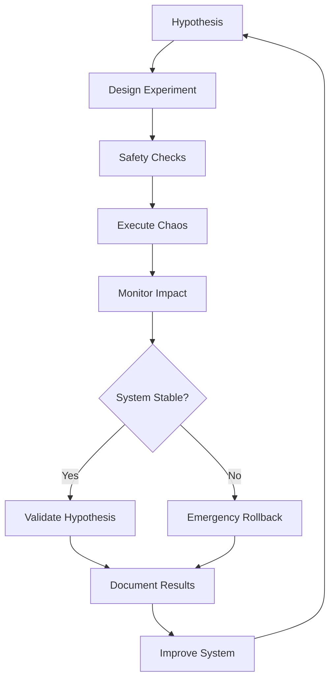

# Chaos Engineering

## 🎯 **Overview**

Chaos Engineering for FootAnalytics platform proactively identifies weaknesses in distributed systems by introducing controlled failures, validating system resilience, and improving overall reliability through systematic experimentation.

## 🏗️ **Chaos Engineering Architecture**

### Components
- **Litmus Chaos**: Kubernetes-native chaos engineering platform
- **Chaos Experiments**: Predefined failure scenarios
- **Chaos Scheduler**: Automated experiment execution
- **Monitoring Integration**: Real-time impact assessment
- **Safety Mechanisms**: Automated rollback and safeguards

### Chaos Workflow


## 🧪 **Chaos Experiments**

### Pod-Level Experiments

#### Pod Deletion
<augment_code_snippet path="infrastructure/k8s/chaos-engineering/chaos-experiments.yaml" mode="EXCERPT">
````yaml
apiVersion: litmuschaos.io/v1alpha1
kind: ChaosEngine
metadata:
  name: api-gateway-chaos
  namespace: footanalytics
spec:
  appinfo:
    appns: footanalytics
    applabel: "app.kubernetes.io/name=api-gateway"
    appkind: deployment
  
  chaosServiceAccount: chaos-service-account
  
  experiments:
    - name: pod-delete
      spec:
        components:
          env:
            - name: TOTAL_CHAOS_DURATION
              value: "60"
            - name: CHAOS_INTERVAL
              value: "10"
            - name: FORCE
              value: "false"
        probe:
          - name: "api-gateway-health-check"
            type: "httpProbe"
            mode: "Continuous"
            runProperties:
              probeTimeout: 5
              retry: 3
              interval: 2
            httpProbe/inputs:
              url: "http://api-gateway.footanalytics.svc.cluster.local:4000/health"
              insecureSkipTLS: true
              method:
                get:
                  criteria: ==
                  responseCode: "200"
````
</augment_code_snippet>

#### Container Kill
```yaml
- name: container-kill
  spec:
    components:
      env:
        - name: TOTAL_CHAOS_DURATION
          value: "60"
        - name: CHAOS_INTERVAL
          value: "10"
        - name: CONTAINER_RUNTIME
          value: "containerd"
        - name: SOCKET_PATH
          value: "/run/containerd/containerd.sock"
    probe:
      - name: "service-availability"
        type: "httpProbe"
        mode: "Continuous"
        httpProbe/inputs:
          url: "http://api-gateway.footanalytics:4000/health"
          method:
            get:
              criteria: ==
              responseCode: "200"
```

### Resource Stress Experiments

#### CPU Stress
```yaml
- name: pod-cpu-hog
  spec:
    components:
      env:
        - name: TOTAL_CHAOS_DURATION
          value: "120"
        - name: CPU_CORES
          value: "1"
        - name: CPU_LOAD
          value: "100"
    probe:
      - name: "response-time-check"
        type: "promProbe"
        mode: "Continuous"
        promProbe/inputs:
          endpoint: "http://prometheus-server.monitoring:80"
          query: "histogram_quantile(0.95, rate(http_request_duration_seconds_bucket{job='api-gateway'}[5m]))"
          comparator:
            criteria: "<"
            value: "0.5"  # 500ms threshold
```

#### Memory Stress
```yaml
- name: pod-memory-hog
  spec:
    components:
      env:
        - name: TOTAL_CHAOS_DURATION
          value: "180"
        - name: MEMORY_CONSUMPTION
          value: "500"  # MB
        - name: NUMBER_OF_WORKERS
          value: "1"
    probe:
      - name: "memory-usage-check"
        type: "promProbe"
        mode: "Continuous"
        promProbe/inputs:
          endpoint: "http://prometheus-server.monitoring:80"
          query: "container_memory_working_set_bytes{pod=~'api-gateway-.*'} / container_spec_memory_limit_bytes"
          comparator:
            criteria: "<"
            value: "0.9"  # 90% memory threshold
```

### Network Chaos Experiments

#### Network Latency
```yaml
- name: pod-network-latency
  spec:
    components:
      env:
        - name: TOTAL_CHAOS_DURATION
          value: "120"
        - name: NETWORK_LATENCY
          value: "2000"  # 2 seconds
        - name: JITTER
          value: "0"
        - name: CONTAINER_RUNTIME
          value: "containerd"
    probe:
      - name: "api-latency-check"
        type: "httpProbe"
        mode: "Continuous"
        httpProbe/inputs:
          url: "http://api-gateway.footanalytics:4000/graphql"
          method:
            post:
              body: '{"query": "{ health }"}'
              criteria: "<"
              responseTimeout: 5000  # 5 seconds
```

#### Network Packet Loss
```yaml
- name: pod-network-loss
  spec:
    components:
      env:
        - name: TOTAL_CHAOS_DURATION
          value: "60"
        - name: NETWORK_PACKET_LOSS_PERCENTAGE
          value: "20"
        - name: CONTAINER_RUNTIME
          value: "containerd"
    probe:
      - name: "database-connection-check"
        type: "cmdProbe"
        mode: "Continuous"
        cmdProbe/inputs:
          command: "pg_isready -h postgres.footanalytics.svc.cluster.local -p 5432"
          comparator:
            type: "string"
            criteria: "contains"
            value: "accepting connections"
```

### ML Pipeline Chaos

#### GPU Memory Stress
```yaml
apiVersion: litmuschaos.io/v1alpha1
kind: ChaosEngine
metadata:
  name: ml-pipeline-gpu-chaos
  namespace: ai-processing
spec:
  appinfo:
    appns: ai-processing
    applabel: "app.kubernetes.io/name=ml-pipeline"
    appkind: deployment
  
  experiments:
    - name: gpu-memory-hog
      spec:
        components:
          env:
            - name: TOTAL_CHAOS_DURATION
              value: "300"
            - name: GPU_MEMORY_PERCENTAGE
              value: "80"
        probe:
          - name: "inference-latency-check"
            type: "promProbe"
            mode: "Continuous"
            promProbe/inputs:
              endpoint: "http://prometheus-server.monitoring:80"
              query: "histogram_quantile(0.99, rate(ml_inference_duration_seconds_bucket[5m]))"
              comparator:
                criteria: "<"
                value: "3.0"  # 3 seconds threshold
```

#### Model Loading Failure
```yaml
- name: model-corruption
  spec:
    components:
      env:
        - name: TOTAL_CHAOS_DURATION
          value: "180"
        - name: FILE_PATH
          value: "/models/football_analysis_v2.pth"
        - name: CORRUPTION_TYPE
          value: "random_bytes"
    probe:
      - name: "model-health-check"
        type: "httpProbe"
        mode: "Continuous"
        httpProbe/inputs:
          url: "http://ml-pipeline.ai-processing:8000/model/health"
          method:
            get:
              criteria: ==
              responseCode: "200"
```

## 📅 **Chaos Scheduling**

### Automated Chaos Schedule
<augment_code_snippet path="infrastructure/k8s/chaos-engineering/chaos-experiments.yaml" mode="EXCERPT">
````yaml
apiVersion: litmuschaos.io/v1alpha1
kind: ChaosSchedule
metadata:
  name: footanalytics-chaos-schedule
  namespace: chaos-engineering
spec:
  schedule:
    now: false
    repeat:
      timeRange:
        startTime: "02:00"
        endTime: "04:00"
      workDays:
        includedDays: "Mon,Tue,Wed,Thu,Fri"
      minChaosInterval: "8h"
  
  engineTemplateSpec:
    appinfo:
      appns: footanalytics
      applabel: "app.kubernetes.io/part-of=footanalytics"
      appkind: deployment
    
    chaosServiceAccount: chaos-service-account
    
    experiments:
      - name: pod-delete
        spec:
          components:
            env:
              - name: TOTAL_CHAOS_DURATION
                value: "30"
              - name: CHAOS_INTERVAL
                value: "10"
              - name: FORCE
                value: "false"
````
</augment_code_snippet>

### Game Day Exercises
```yaml
# Monthly Game Day Schedule
game_days:
  frequency: "monthly"
  duration: "4 hours"
  participants:
    - platform_engineering
    - ml_engineering
    - devops
    - product_management
  
  scenarios:
    - name: "Complete Region Failure"
      description: "Simulate AWS region outage"
      duration: "2 hours"
      experiments:
        - zone_failure
        - database_failover
        - traffic_rerouting
    
    - name: "ML Pipeline Overload"
      description: "Simulate high video processing load"
      duration: "1 hour"
      experiments:
        - gpu_exhaustion
        - queue_overflow
        - model_degradation
    
    - name: "Security Incident"
      description: "Simulate security breach response"
      duration: "1 hour"
      experiments:
        - network_isolation
        - credential_rotation
        - audit_log_analysis
```

## 📊 **Chaos Monitoring**

### Chaos Metrics
```yaml
chaos_metrics:
  experiment_success_rate:
    description: "Percentage of successful chaos experiments"
    query: "chaos_experiment_success_total / chaos_experiment_total * 100"
    target: "> 95%"
  
  system_recovery_time:
    description: "Time for system to recover from chaos"
    query: "chaos_recovery_duration_seconds"
    target: "< 300 seconds"
  
  blast_radius:
    description: "Scope of impact from chaos experiments"
    query: "chaos_affected_services_count"
    target: "Contained to target service"
  
  hypothesis_validation_rate:
    description: "Percentage of validated hypotheses"
    query: "chaos_hypothesis_validated_total / chaos_hypothesis_total * 100"
    target: "> 80%"
```

### Chaos Dashboard
```json
{
  "dashboard": {
    "title": "Chaos Engineering Dashboard",
    "panels": [
      {
        "title": "Experiment Status",
        "type": "stat",
        "targets": [
          {
            "expr": "chaos_experiment_status",
            "legendFormat": "{{experiment_name}} - {{status}}"
          }
        ],
        "fieldConfig": {
          "defaults": {
            "mappings": [
              {"options": {"0": {"text": "Failed", "color": "red"}}, "type": "value"},
              {"options": {"1": {"text": "Running", "color": "yellow"}}, "type": "value"},
              {"options": {"2": {"text": "Completed", "color": "green"}}, "type": "value"}
            ]
          }
        }
      },
      {
        "title": "System Recovery Time",
        "type": "timeseries",
        "targets": [
          {
            "expr": "chaos_recovery_duration_seconds",
            "legendFormat": "Recovery Time"
          }
        ],
        "fieldConfig": {
          "defaults": {
            "unit": "seconds",
            "thresholds": {
              "steps": [
                {"color": "green", "value": 0},
                {"color": "yellow", "value": 300},
                {"color": "red", "value": 600}
              ]
            }
          }
        }
      }
    ]
  }
}
```

## 🔒 **Safety Mechanisms**

### Chaos Guards
```python
# Chaos safety checks
class ChaosGuards:
    def __init__(self, prometheus_url):
        self.prometheus_url = prometheus_url
    
    def pre_experiment_checks(self, experiment_config):
        """Run safety checks before experiment"""
        checks = [
            self._check_system_health(),
            self._check_error_budget(),
            self._check_ongoing_incidents(),
            self._check_deployment_freeze(),
        ]
        
        return all(checks)
    
    def _check_system_health(self):
        """Verify system is healthy before chaos"""
        query = "up{job='api-gateway'}"
        result = self._query_prometheus(query)
        
        if not result or float(result[0]['value'][1]) < 1:
            self.logger.warning("System health check failed")
            return False
        return True
    
    def _check_error_budget(self):
        """Ensure sufficient error budget"""
        query = "slo:platform_availability:error_budget_remaining"
        result = self._query_prometheus(query)
        
        if not result or float(result[0]['value'][1]) < 0.1:  # 10% threshold
            self.logger.warning("Insufficient error budget for chaos experiment")
            return False
        return True
    
    def _check_ongoing_incidents(self):
        """Check for active incidents"""
        # Query PagerDuty API for active incidents
        incidents = self._get_active_incidents()
        
        if incidents:
            self.logger.warning(f"Active incidents found: {len(incidents)}")
            return False
        return True
    
    def _check_deployment_freeze(self):
        """Check for deployment freeze periods"""
        # Check for deployment freeze flags
        freeze_status = self._check_deployment_freeze_status()
        
        if freeze_status:
            self.logger.warning("Deployment freeze active")
            return False
        return True
```

### Automated Rollback
```yaml
# Automated rollback configuration
rollback_triggers:
  error_rate_threshold: 0.05  # 5% error rate
  latency_threshold: 2.0      # 2 seconds P95
  availability_threshold: 0.95 # 95% availability
  
rollback_actions:
  - name: "Stop chaos experiment"
    action: "kubectl delete chaosengine {experiment_name} -n {namespace}"
  
  - name: "Scale up replicas"
    condition: "pod_count < min_replicas"
    action: "kubectl scale deployment {deployment} --replicas={min_replicas}"
  
  - name: "Restart unhealthy pods"
    condition: "pod_restart_count > threshold"
    action: "kubectl delete pod -l app.kubernetes.io/name={service}"
  
  - name: "Trigger incident"
    condition: "recovery_time > 300"
    action: "create_pagerduty_incident"
```

## 🧪 **Experiment Design**

### Hypothesis-Driven Experiments
```yaml
# Experiment template
experiment_template:
  hypothesis: "The API Gateway can handle 50% pod failures without service degradation"
  
  steady_state:
    - "API response time P95 < 200ms"
    - "Error rate < 1%"
    - "All health checks passing"
  
  experiment:
    - "Delete 50% of API Gateway pods"
    - "Monitor for 10 minutes"
    - "Verify steady state maintained"
  
  success_criteria:
    - "No increase in error rate"
    - "Response time remains < 200ms"
    - "Service remains available"
  
  rollback_plan:
    - "Stop pod deletion"
    - "Scale deployment to full capacity"
    - "Verify service recovery"
```

### Progressive Chaos
```yaml
# Progressive experiment stages
progressive_chaos:
  stage_1:
    name: "Single Pod Failure"
    chaos_percentage: 10
    duration: "5 minutes"
    success_threshold: 0.99
  
  stage_2:
    name: "Multiple Pod Failures"
    chaos_percentage: 30
    duration: "10 minutes"
    success_threshold: 0.95
    depends_on: stage_1
  
  stage_3:
    name: "Majority Pod Failures"
    chaos_percentage: 60
    duration: "15 minutes"
    success_threshold: 0.90
    depends_on: stage_2
```

## 📋 **Best Practices**

### Experiment Design
1. **Start Small**: Begin with low-impact experiments
2. **Hypothesis-Driven**: Always start with a clear hypothesis
3. **Measurable**: Define clear success/failure criteria
4. **Reversible**: Ensure experiments can be quickly stopped
5. **Isolated**: Limit blast radius to specific components

### Safety First
1. **Pre-checks**: Always run safety checks before experiments
2. **Monitoring**: Continuously monitor during experiments
3. **Rollback**: Have automated rollback mechanisms
4. **Communication**: Notify teams about scheduled chaos
5. **Documentation**: Document all experiments and results

### Continuous Improvement
1. **Regular Reviews**: Review experiment results regularly
2. **Expand Scope**: Gradually increase experiment complexity
3. **Automate**: Automate repetitive experiments
4. **Share Learnings**: Share results across teams
5. **Update Systems**: Use findings to improve system resilience

## 🔧 **Troubleshooting**

### Common Issues

#### 1. Experiment Failures
```bash
# Check experiment status
kubectl get chaosengine -A

# View experiment logs
kubectl logs -n litmus deployment/chaos-operator-ce

# Check experiment results
kubectl get chaosresult -A -o yaml
```

#### 2. Safety Check Failures
```bash
# Verify system health
curl http://prometheus:9090/api/v1/query?query=up

# Check error budget
curl http://prometheus:9090/api/v1/query?query=slo:platform_availability:error_budget_remaining

# Verify no active incidents
curl -H "Authorization: Token YOUR_TOKEN" https://api.pagerduty.com/incidents
```

#### 3. Rollback Issues
```bash
# Manual experiment cleanup
kubectl delete chaosengine --all -n footanalytics

# Force pod restart
kubectl delete pods -l app.kubernetes.io/name=api-gateway -n footanalytics

# Check service recovery
kubectl get pods -n footanalytics
curl http://api-gateway.footanalytics:4000/health
```

---

**Next Steps**: [Security](../security/SECURITY.md) | [Performance Optimization](../performance/PERFORMANCE.md)
