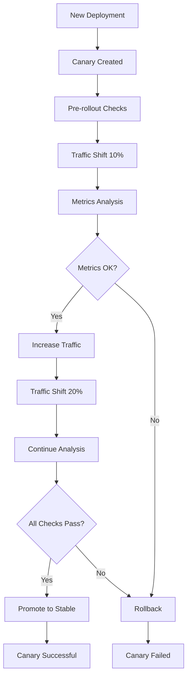

# Canary Deployments with Flagger

## 🎯 **Overview**

Flagger provides automated canary deployments for FootAnalytics platform, enabling progressive delivery with automatic rollbacks based on metrics analysis and custom validation.

## 🏗️ **Architecture**

### Components
- **Flagger Controller**: Manages canary deployments and traffic shifting
- **Istio Service Mesh**: Provides traffic management and observability
- **Prometheus**: Metrics collection for canary analysis
- **Load Tester**: Automated testing during canary analysis

### Canary Workflow


## 🚀 **Installation & Configuration**

### Prerequisites
- Kubernetes cluster with Istio service mesh
- Prometheus for metrics collection
- Flagger CRDs installed

### Installation Steps

#### 1. Install Flagger
```bash
# Add Flagger Helm repository
helm repo add flagger https://flagger.app
helm repo update

# Install Flagger
helm upgrade --install flagger flagger/flagger \
  --namespace istio-system \
  --set meshProvider=istio \
  --set metricsServer=http://prometheus-server.monitoring:80
```

#### 2. Install Load Tester
```bash
# Install Flagger load tester
helm upgrade --install flagger-loadtester flagger/loadtester \
  --namespace test \
  --create-namespace
```

#### 3. Verify Installation
```bash
# Check Flagger pods
kubectl get pods -n istio-system -l app.kubernetes.io/name=flagger

# Check load tester
kubectl get pods -n test -l app.kubernetes.io/name=loadtester
```

## 📋 **Canary Configuration**

### API Gateway Canary
<augment_code_snippet path="infrastructure/k8s/overlays/production/canary-deployments.yaml" mode="EXCERPT">
````yaml
apiVersion: flagger.app/v1beta1
kind: Canary
metadata:
  name: api-gateway
  namespace: footanalytics
spec:
  targetRef:
    apiVersion: apps/v1
    kind: Deployment
    name: api-gateway
  
  progressDeadlineSeconds: 600
  
  service:
    port: 4000
    targetPort: 4000
    trafficPolicy:
      tls:
        mode: ISTIO_MUTUAL
    gateways:
      - footanalytics-gateway.istio-system.svc.cluster.local
    hosts:
      - api.footanalytics.com
````
</augment_code_snippet>

### ML Pipeline Canary
<augment_code_snippet path="infrastructure/k8s/overlays/production/canary-deployments.yaml" mode="EXCERPT">
````yaml
apiVersion: flagger.app/v1beta1
kind: Canary
metadata:
  name: ml-pipeline
  namespace: ai-processing
spec:
  targetRef:
    apiVersion: apps/v1
    kind: Deployment
    name: ml-pipeline
  
  progressDeadlineSeconds: 900
  
  analysis:
    interval: 3m
    threshold: 3
    maxWeight: 25
    stepWeight: 5
    metrics:
      - name: request-success-rate
        thresholdRange:
          min: 95
        interval: 2m
      - name: inference-latency
        thresholdRange:
          max: 2000
        interval: 1m
````
</augment_code_snippet>

## 📊 **Metrics & Analysis**

### Built-in Metrics

#### Success Rate
```yaml
metrics:
  - name: request-success-rate
    thresholdRange:
      min: 99
    interval: 1m
```

#### Request Duration
```yaml
metrics:
  - name: request-duration
    thresholdRange:
      max: 200
    interval: 30s
```

### Custom Metrics

#### GPU Utilization
```yaml
metrics:
  - name: gpu-utilization
    templateRef:
      name: gpu-utilization
      namespace: flagger-system
    thresholdRange:
      min: 60
      max: 90
    interval: 2m
```

#### Model Accuracy
```yaml
metrics:
  - name: model-accuracy
    templateRef:
      name: model-accuracy
      namespace: flagger-system
    thresholdRange:
      min: 85
    interval: 5m
```

### Metric Templates
```yaml
apiVersion: flagger.app/v1beta1
kind: MetricTemplate
metadata:
  name: gpu-utilization
  namespace: flagger-system
spec:
  provider:
    type: prometheus
    address: http://prometheus-server.monitoring:80
  query: |
    avg(nvidia_gpu_utilization_gpu{
      namespace="{{ namespace }}",
      pod=~"{{ target }}-canary-.*"
    })
```

## 🧪 **Testing & Validation**

### Pre-rollout Webhooks
```yaml
webhooks:
  - name: acceptance-test
    type: pre-rollout
    url: http://flagger-loadtester.test/api/v1/canary
    timeout: 30s
    metadata:
      type: bash
      cmd: "curl -sd 'test' http://api-gateway-canary.footanalytics:4000/health | grep OK"
```

### Load Testing Webhooks
```yaml
webhooks:
  - name: load-test
    url: http://flagger-loadtester.test/api/v1/canary
    timeout: 5s
    metadata:
      cmd: "hey -z 2m -q 10 -c 2 http://api-gateway-canary.footanalytics:4000/graphql"
```

### ML Model Validation
```yaml
webhooks:
  - name: ml-validation
    type: pre-rollout
    url: http://flagger-loadtester.test/api/v1/canary
    timeout: 120s
    metadata:
      type: bash
      cmd: "python /scripts/validate_ml_model.py --endpoint http://ml-pipeline-canary.ai-processing:8000 --accuracy-threshold 0.85"
```

## 🔧 **Traffic Management**

### Traffic Shifting Strategy
```yaml
analysis:
  interval: 1m          # Analysis interval
  threshold: 5          # Failed checks before rollback
  maxWeight: 50         # Maximum canary traffic
  stepWeight: 10        # Traffic increment step
  iterations: 10        # Number of iterations
```

### Progressive Delivery Timeline
1. **0%**: Initial deployment (stable: 100%, canary: 0%)
2. **10%**: First traffic shift (stable: 90%, canary: 10%)
3. **20%**: Second increment (stable: 80%, canary: 20%)
4. **30%**: Third increment (stable: 70%, canary: 30%)
5. **40%**: Fourth increment (stable: 60%, canary: 40%)
6. **50%**: Final increment (stable: 50%, canary: 50%)
7. **100%**: Promotion (stable: 0%, canary: 100%)

### Istio Integration
```yaml
# Virtual Service created by Flagger
apiVersion: networking.istio.io/v1beta1
kind: VirtualService
metadata:
  name: api-gateway
  namespace: footanalytics
spec:
  gateways:
    - footanalytics-gateway
  hosts:
    - api.footanalytics.com
  http:
    - match:
        - headers:
            canary:
              exact: "true"
      route:
        - destination:
            host: api-gateway-canary
          weight: 100
    - route:
        - destination:
            host: api-gateway-primary
          weight: 90
        - destination:
            host: api-gateway-canary
          weight: 10
```

## 📈 **Monitoring & Observability**

### Canary Status
```bash
# Check canary status
kubectl get canary -n footanalytics

# Describe canary for detailed information
kubectl describe canary api-gateway -n footanalytics

# View canary events
kubectl get events --field-selector involvedObject.name=api-gateway -n footanalytics
```

### Flagger Metrics
```bash
# Canary duration
flagger_canary_duration_seconds_bucket

# Canary status
flagger_canary_status

# Traffic weight
flagger_canary_weight
```

### Grafana Dashboard
```json
{
  "dashboard": {
    "title": "Flagger Canary Analysis",
    "panels": [
      {
        "title": "Canary Success Rate",
        "targets": [
          {
            "expr": "histogram_quantile(0.99, sum(rate(istio_request_duration_milliseconds_bucket{destination_service_name=~\".*-canary\"}[1m])) by (le))"
          }
        ]
      },
      {
        "title": "Traffic Weight",
        "targets": [
          {
            "expr": "flagger_canary_weight"
          }
        ]
      }
    ]
  }
}
```

## 🚨 **Alerting & Notifications**

### Canary Alerts
```yaml
groups:
  - name: flagger.rules
    rules:
      - alert: CanaryFailed
        expr: flagger_canary_status == 0
        for: 1m
        labels:
          severity: warning
        annotations:
          summary: "Canary deployment failed"
          description: "Canary {{ $labels.name }} in namespace {{ $labels.namespace }} has failed"

      - alert: CanaryStuck
        expr: flagger_canary_duration_seconds > 1800
        for: 5m
        labels:
          severity: critical
        annotations:
          summary: "Canary deployment stuck"
          description: "Canary {{ $labels.name }} has been running for more than 30 minutes"
```

### Slack Notifications
```yaml
# Flagger Slack integration
apiVersion: v1
kind: Secret
metadata:
  name: slack-url
  namespace: flagger-system
data:
  address: <base64-encoded-slack-webhook-url>

---
apiVersion: flagger.app/v1beta1
kind: AlertProvider
metadata:
  name: slack
  namespace: flagger-system
spec:
  type: slack
  channel: "#deployments"
  username: "flagger"
  secretRef:
    name: slack-url
```

## 🔄 **Rollback Procedures**

### Automatic Rollback
Flagger automatically rolls back when:
- Metrics exceed threshold values
- Pre-rollout webhooks fail
- Load testing webhooks fail
- Analysis timeout is reached

### Manual Rollback
```bash
# Manually trigger rollback
kubectl patch canary api-gateway -n footanalytics \
  --type='merge' -p='{"spec":{"analysis":{"threshold":0}}}'

# Reset canary to restart analysis
kubectl patch canary api-gateway -n footanalytics \
  --type='merge' -p='{"spec":{"skipAnalysis":false}}'
```

### Emergency Rollback
```bash
# Immediate traffic shift to stable version
kubectl patch virtualservice api-gateway -n footanalytics \
  --type='json' -p='[{"op": "replace", "path": "/spec/http/0/route/0/weight", "value": 100}]'
```

## 🛠️ **Troubleshooting**

### Common Issues

#### 1. Canary Stuck in Progressing
```bash
# Check canary status
kubectl describe canary api-gateway -n footanalytics

# Check metrics availability
kubectl logs -n istio-system deployment/flagger
```

#### 2. Metrics Not Available
```bash
# Verify Prometheus connectivity
kubectl exec -n istio-system deployment/flagger -- \
  wget -qO- http://prometheus-server.monitoring:80/api/v1/query?query=up

# Check metric templates
kubectl get metrictemplates -n flagger-system
```

#### 3. Webhook Failures
```bash
# Check load tester logs
kubectl logs -n test deployment/flagger-loadtester

# Test webhook manually
kubectl exec -n test deployment/flagger-loadtester -- \
  curl -X POST http://flagger-loadtester/api/v1/canary \
  -d '{"name":"api-gateway","namespace":"footanalytics"}'
```

### Debugging Commands
```bash
# View Flagger controller logs
kubectl logs -f -n istio-system deployment/flagger

# Check Istio proxy configuration
istioctl proxy-config route api-gateway-canary-xxx.footanalytics

# Verify service mesh connectivity
kubectl exec -n footanalytics deployment/api-gateway-canary -- \
  curl -v http://prometheus-server.monitoring:80/metrics
```

## 📋 **Best Practices**

### Canary Configuration
1. **Start Small**: Begin with low traffic percentages (5-10%)
2. **Gradual Increase**: Use small step weights for better control
3. **Multiple Metrics**: Combine success rate, latency, and business metrics
4. **Timeout Settings**: Set appropriate analysis timeouts

### Testing Strategy
1. **Pre-rollout Validation**: Always include health checks
2. **Load Testing**: Generate realistic traffic during analysis
3. **Business Logic Tests**: Validate critical functionality
4. **Rollback Testing**: Regularly test rollback procedures

### Monitoring
1. **Real-time Dashboards**: Monitor canary progress in real-time
2. **Alert Configuration**: Set up alerts for failed deployments
3. **Metric Collection**: Ensure all required metrics are available
4. **Log Aggregation**: Centralize logs for troubleshooting

## 📈 **Performance Optimization**

### Analysis Optimization
```yaml
analysis:
  interval: 30s        # Faster feedback loop
  threshold: 3         # Fail fast on issues
  maxWeight: 30        # Limit blast radius
  stepWeight: 5        # Smaller increments
```

### Resource Management
```yaml
# Canary resource limits
resources:
  limits:
    cpu: 500m
    memory: 512Mi
  requests:
    cpu: 250m
    memory: 256Mi
```

---

**Next Steps**: [Feature Flags](../feature-flags/FEATURE_FLAGS.md) | [Distributed Tracing](../observability/DISTRIBUTED_TRACING.md)
