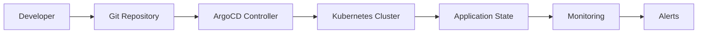

# GitOps with ArgoCD

## 🎯 **Overview**

ArgoCD provides declarative GitOps continuous delivery for FootAnalytics platform, ensuring that the desired state defined in Git repositories is automatically synchronized with the Kubernetes cluster.

## 🏗️ **Architecture**

### Components
- **ArgoCD Server**: Web UI and API server
- **Application Controller**: Monitors Git repositories and manages applications
- **Repository Server**: Manages Git repository connections
- **Redis**: Caching and session storage
- **Dex**: OIDC authentication (optional)

### GitOps Workflow


## 🚀 **Installation & Configuration**

### Prerequisites
- Kubernetes cluster (EKS recommended)
- kubectl configured
- Helm 3.x installed
- Git repository for application manifests

### Installation Steps

#### 1. Create Namespace
```bash
kubectl create namespace argocd
```

#### 2. Install ArgoCD using Terraform
```bash
cd infrastructure/terraform
terraform apply -target=module.argocd
```

#### 3. Verify Installation
```bash
# Check ArgoCD pods
kubectl get pods -n argocd

# Wait for all pods to be ready
kubectl wait --for=condition=Ready pod --all -n argocd --timeout=300s
```

#### 4. Access ArgoCD UI
```bash
# Port forward to access UI
kubectl port-forward svc/argocd-server -n argocd 8080:443

# Get admin password
kubectl -n argocd get secret argocd-initial-admin-secret \
  -o jsonpath="{.data.password}" | base64 -d
```

### Configuration Files

#### ArgoCD Values (Helm)
<augment_code_snippet path="infrastructure/terraform/modules/argocd/values.yaml" mode="EXCERPT">
````yaml
# ArgoCD Helm Chart Values for Production
global:
  image:
    tag: "v2.8.4"
  
server:
  replicas: 2
  
  # High Availability Configuration
  env:
    - name: ARGOCD_SERVER_INSECURE
      value: "false"
    - name: ARGOCD_SERVER_ROOTPATH
      value: "/argocd"
````
</augment_code_snippet>

#### Application Configuration
<augment_code_snippet path="infrastructure/terraform/modules/argocd/main.tf" mode="EXCERPT">
````terraform
# ArgoCD Application for FootAnalytics Platform
resource "kubernetes_manifest" "footanalytics_app" {
  manifest = {
    apiVersion = "argoproj.io/v1alpha1"
    kind       = "Application"
    metadata = {
      name      = "footanalytics-platform"
      namespace = kubernetes_namespace.argocd.metadata[0].name
    }
    spec = {
      project = "default"
      source = {
        repoURL        = var.git_repo_url
        targetRevision = "HEAD"
        path           = "infrastructure/k8s/overlays/production"
      }
````
</augment_code_snippet>

## 📁 **Repository Structure**

### GitOps Repository Layout
```
gitops-config/
├── applications/
│   ├── api-gateway.yaml
│   ├── video-ingestion.yaml
│   ├── ml-pipeline.yaml
│   └── analytics-engine.yaml
├── projects/
│   └── footanalytics.yaml
├── overlays/
│   ├── staging/
│   │   ├── kustomization.yaml
│   │   ├── patches/
│   │   └── secrets/
│   └── production/
│       ├── kustomization.yaml
│       ├── patches/
│       └── secrets/
└── base/
    ├── deployments/
    ├── services/
    ├── configmaps/
    └── secrets/
```

### Application Manifest Example
```yaml
apiVersion: argoproj.io/v1alpha1
kind: Application
metadata:
  name: api-gateway
  namespace: argocd
  labels:
    app.kubernetes.io/name: api-gateway
    app.kubernetes.io/part-of: footanalytics
spec:
  project: footanalytics
  source:
    repoURL: https://github.com/footanalytics/gitops-config
    targetRevision: HEAD
    path: overlays/production/api-gateway
  destination:
    server: https://kubernetes.default.svc
    namespace: footanalytics
  syncPolicy:
    automated:
      prune: true
      selfHeal: true
    syncOptions:
      - CreateNamespace=true
      - PrunePropagationPolicy=foreground
    retry:
      limit: 5
      backoff:
        duration: 5s
        factor: 2
        maxDuration: 3m
```

## 🔧 **Application Management**

### Creating Applications

#### Using ArgoCD CLI
```bash
# Login to ArgoCD
argocd login argocd-server.argocd.svc.cluster.local:443

# Create application
argocd app create api-gateway \
  --repo https://github.com/footanalytics/gitops-config \
  --path overlays/production/api-gateway \
  --dest-server https://kubernetes.default.svc \
  --dest-namespace footanalytics \
  --sync-policy automated \
  --auto-prune \
  --self-heal
```

#### Using Kubernetes Manifests
```bash
kubectl apply -f applications/api-gateway.yaml
```

### Sync Policies

#### Automatic Sync
```yaml
syncPolicy:
  automated:
    prune: true      # Remove resources not in Git
    selfHeal: true   # Revert manual changes
  syncOptions:
    - CreateNamespace=true
    - PrunePropagationPolicy=foreground
```

#### Manual Sync
```yaml
syncPolicy:
  syncOptions:
    - CreateNamespace=true
  retry:
    limit: 3
    backoff:
      duration: 5s
      factor: 2
      maxDuration: 1m
```

## 🔐 **Security & RBAC**

### Project Configuration
<augment_code_snippet path="infrastructure/terraform/modules/argocd/main.tf" mode="EXCERPT">
````terraform
# ArgoCD Project for FootAnalytics
resource "kubernetes_manifest" "footanalytics_project" {
  manifest = {
    apiVersion = "argoproj.io/v1alpha1"
    kind       = "AppProject"
    metadata = {
      name      = "footanalytics"
      namespace = kubernetes_namespace.argocd.metadata[0].name
    }
    spec = {
      description = "FootAnalytics AI Platform Project"
      sourceRepos = [
        var.git_repo_url,
        "https://charts.helm.sh/stable"
      ]
````
</augment_code_snippet>

### RBAC Configuration
```yaml
# ArgoCD RBAC Policy
policy.csv: |
  p, role:admin, applications, *, */*, allow
  p, role:admin, clusters, *, *, allow
  p, role:admin, repositories, *, *, allow
  p, role:developer, applications, get, */*, allow
  p, role:developer, applications, sync, */*, allow
  g, footanalytics:admin, role:admin
  g, footanalytics:developer, role:developer
```

### Repository Access
```yaml
# Repository credentials
credentialTemplates:
  github-creds:
    url: https://github.com/footanalytics
    username: not-used
    password: ${github_token}
```

## 📊 **Monitoring & Observability**

### Health Checks
```bash
# Check application health
argocd app get api-gateway

# Check sync status
argocd app sync-status api-gateway

# View application logs
argocd app logs api-gateway
```

### Metrics Integration
```yaml
# ServiceMonitor for Prometheus
apiVersion: monitoring.coreos.com/v1
kind: ServiceMonitor
metadata:
  name: argocd-metrics
  namespace: monitoring
spec:
  selector:
    matchLabels:
      app.kubernetes.io/name: argocd-metrics
  endpoints:
    - port: metrics
      interval: 30s
```

### Key Metrics
- **Application Sync Status**: `argocd_app_info`
- **Sync Duration**: `argocd_app_sync_total`
- **Health Status**: `argocd_app_health_status`
- **Repository Sync**: `argocd_git_request_total`

## 🔔 **Notifications**

### Slack Integration
<augment_code_snippet path="infrastructure/terraform/modules/argocd/notifications-config.yaml" mode="EXCERPT">
````yaml
# ArgoCD Notifications Configuration
service.slack: |
  token: $slack-token
  
template.app-deployed: |
  slack:
    attachments: |
      [{
        "title": "🚀 Application Deployed",
        "title_link": "{{.context.argocdUrl}}/applications/{{.app.metadata.name}}",
        "color": "good",
        "fields": [
        {
          "title": "Application",
          "value": "{{.app.metadata.name}}",
          "short": true
        }]
      }]
````
</augment_code_snippet>

### Teams Integration
```yaml
service.webhook.teams: |
  url: ${teams_webhook_url}
  headers:
  - name: Content-Type
    value: application/json

template.app-deployed: |
  webhook:
    teams:
      method: POST
      body: |
        {
          "@type": "MessageCard",
          "themeColor": "00FF00",
          "summary": "Application Deployed",
          "sections": [{
            "activityTitle": "🚀 Application Deployed Successfully"
          }]
        }
```

## 🔄 **CI/CD Integration**

### GitHub Actions Workflow
<augment_code_snippet path=".github/workflows/ci-cd-testing.yml" mode="EXCERPT">
````yaml
  # Deploy to Staging with GitOps
  deploy-staging:
    name: Deploy to Staging
    runs-on: ubuntu-latest
    needs: [build-and-push]
    environment: staging
    steps:
      - name: Checkout GitOps repository
        uses: actions/checkout@v4
        with:
          repository: footanalytics/gitops-config
          token: ${{ secrets.GITOPS_TOKEN }}
          path: gitops

      - name: Update staging manifests
        run: |
          cd gitops
          sed -i "s|image: .*|image: ${{ needs.build-and-push.outputs.image-tag }}|g" \
            overlays/staging/kustomization.yaml
````
</augment_code_snippet>

### Image Update Automation
```yaml
# ArgoCD Image Updater
apiVersion: argoproj.io/v1alpha1
kind: Application
metadata:
  annotations:
    argocd-image-updater.argoproj.io/image-list: api-gateway=footanalytics/api-gateway
    argocd-image-updater.argoproj.io/write-back-method: git
    argocd-image-updater.argoproj.io/git-branch: main
```

## 🛠️ **Troubleshooting**

### Common Issues

#### 1. Application Out of Sync
```bash
# Force sync
argocd app sync api-gateway --force

# Check differences
argocd app diff api-gateway
```

#### 2. Repository Connection Issues
```bash
# Test repository connection
argocd repo get https://github.com/footanalytics/gitops-config

# Update repository credentials
argocd repo add https://github.com/footanalytics/gitops-config \
  --username token --password $GITHUB_TOKEN
```

#### 3. RBAC Issues
```bash
# Check user permissions
argocd account can-i sync applications '*'

# Update RBAC policy
kubectl patch configmap argocd-rbac-cm -n argocd --patch='{"data":{"policy.csv":"..."}}'
```

### Debugging Commands
```bash
# View ArgoCD server logs
kubectl logs -f deployment/argocd-server -n argocd

# View application controller logs
kubectl logs -f deployment/argocd-application-controller -n argocd

# Check application events
kubectl describe application api-gateway -n argocd
```

## 📋 **Best Practices**

### Repository Management
1. **Separate Config Repository**: Keep application code and configuration separate
2. **Environment Branches**: Use branches or directories for different environments
3. **Atomic Commits**: Make small, focused commits for easier rollbacks
4. **Signed Commits**: Use GPG signing for security

### Application Design
1. **Declarative Configuration**: Use Kubernetes manifests or Helm charts
2. **Resource Limits**: Always specify resource requests and limits
3. **Health Checks**: Implement proper readiness and liveness probes
4. **Secrets Management**: Use external secret operators

### Security
1. **Least Privilege**: Grant minimal required permissions
2. **Repository Access**: Use deploy keys or service accounts
3. **Network Policies**: Implement network segmentation
4. **Regular Updates**: Keep ArgoCD updated to latest stable version

## 📈 **Performance Optimization**

### Scaling ArgoCD
```yaml
# High availability configuration
server:
  replicas: 3
  resources:
    limits:
      cpu: 500m
      memory: 512Mi
    requests:
      cpu: 250m
      memory: 256Mi

controller:
  replicas: 2
  resources:
    limits:
      cpu: 1000m
      memory: 1Gi
```

### Repository Optimization
1. **Shallow Clones**: Enable shallow cloning for large repositories
2. **Webhook Configuration**: Use webhooks for faster sync detection
3. **Resource Caching**: Enable resource caching for better performance

---

**Next Steps**: [Canary Deployments](../deployment/CANARY_DEPLOYMENTS.md) | [Feature Flags](../feature-flags/FEATURE_FLAGS.md)
