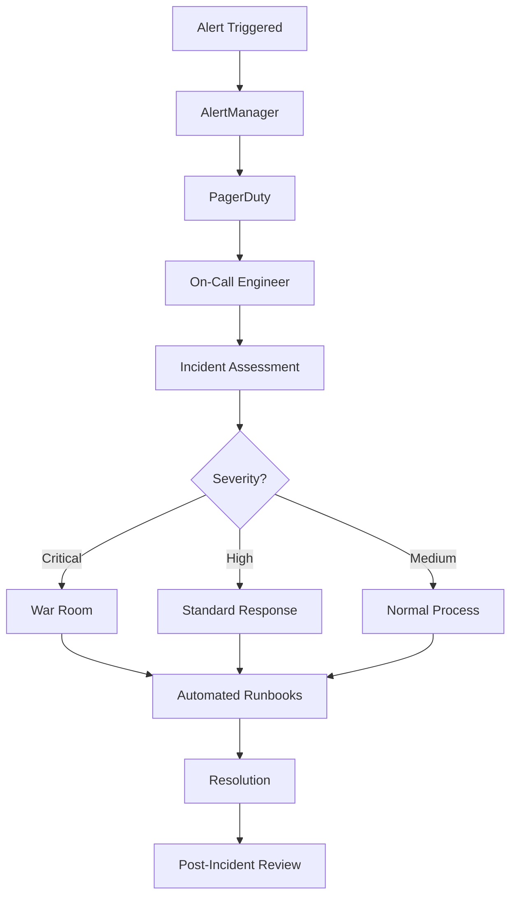

# Incident Response & Management

## 🎯 **Overview**

FootAnalytics platform implements comprehensive incident response with PagerDuty integration, automated escalation, runbook automation, and post-incident analysis to ensure rapid resolution and continuous improvement.

## 🏗️ **Incident Response Architecture**

### Components
- **PagerDuty**: Incident management and escalation
- **AlertManager**: Alert routing and grouping
- **Runbook Automation**: Automated response procedures
- **Status Page**: External communication
- **ChatOps**: Slack/Teams integration

### Incident Flow


## 🚨 **Severity Levels**

### Severity Classification
```yaml
severity_levels:
  critical:
    description: "Complete service outage or data loss"
    response_time: "5 minutes"
    escalation: "Immediate"
    examples:
      - "Platform completely unavailable"
      - "Data corruption or loss"
      - "Security breach"
    
  high:
    description: "Major functionality impaired"
    response_time: "15 minutes"
    escalation: "30 minutes"
    examples:
      - "ML pipeline completely down"
      - "Video uploads failing >50%"
      - "Performance degraded >50%"
    
  medium:
    description: "Minor functionality impaired"
    response_time: "1 hour"
    escalation: "4 hours"
    examples:
      - "Single service degraded"
      - "Non-critical features unavailable"
      - "Performance degraded <25%"
    
  low:
    description: "Minimal impact"
    response_time: "4 hours"
    escalation: "Next business day"
    examples:
      - "Monitoring alerts"
      - "Documentation issues"
      - "Minor UI bugs"
```

## 👥 **Escalation Policies**

### PagerDuty Configuration
<augment_code_snippet path="infrastructure/terraform/modules/pagerduty/main.tf" mode="EXCERPT">
````terraform
# Escalation Policy for Platform
resource "pagerduty_escalation_policy" "footanalytics" {
  name      = "FootAnalytics Platform Escalation"
  num_loops = 2

  rule {
    escalation_delay_in_minutes = 10
    target {
      type = "user"
      id   = pagerduty_user.platform_engineer.id
    }
  }

  rule {
    escalation_delay_in_minutes = 15
    target {
      type = "user"
      id   = pagerduty_user.tech_lead.id
    }
  }

  rule {
    escalation_delay_in_minutes = 30
    target {
      type = "user"
      id   = pagerduty_user.cto.id
    }
  }
}
````
</augment_code_snippet>

### Team Structure
```yaml
teams:
  platform_engineering:
    primary_oncall: "platform-engineer"
    secondary_oncall: "senior-platform-engineer"
    escalation_manager: "tech-lead"
    
  ml_engineering:
    primary_oncall: "ml-engineer"
    secondary_oncall: "senior-ml-engineer"
    escalation_manager: "ml-tech-lead"
    
  infrastructure:
    primary_oncall: "devops-engineer"
    secondary_oncall: "senior-devops-engineer"
    escalation_manager: "infrastructure-lead"
```

## 📚 **Runbooks**

### Automated Runbooks
```yaml
# High CPU Usage Runbook
runbooks:
  high_cpu_usage:
    trigger: "NodeCPUUsageHigh"
    severity: "medium"
    automated_steps:
      - name: "Identify top processes"
        command: "kubectl top pods --sort-by=cpu -A"
      - name: "Check resource limits"
        command: "kubectl describe pod {pod_name} -n {namespace}"
      - name: "Scale if needed"
        condition: "cpu_usage > 90%"
        command: "kubectl scale deployment {deployment} --replicas={current_replicas + 1}"
    
    manual_steps:
      - "Review application logs for errors"
      - "Check for memory leaks"
      - "Consider vertical scaling"
      - "Update resource requests/limits"
```

### Runbook Templates
```markdown
# Runbook Template

## Alert: {ALERT_NAME}

### Summary
Brief description of the issue and its impact.

### Severity: {SEVERITY}
- **Response Time**: {RESPONSE_TIME}
- **Escalation**: {ESCALATION_TIME}

### Automated Checks
- [ ] Service health status
- [ ] Resource utilization
- [ ] Error rates
- [ ] Dependencies status

### Investigation Steps
1. **Check service status**
   ```bash
   kubectl get pods -n {namespace}
   kubectl describe pod {pod_name}
   ```

2. **Review logs**
   ```bash
   kubectl logs -f deployment/{service} -n {namespace}
   ```

3. **Check metrics**
   - Grafana dashboard: {DASHBOARD_URL}
   - Key metrics: {METRICS_LIST}

### Resolution Steps
1. **Immediate actions**
   - {ACTION_1}
   - {ACTION_2}

2. **If issue persists**
   - {ESCALATION_ACTION}
   - Contact: {ESCALATION_CONTACT}

### Post-Resolution
- [ ] Verify service recovery
- [ ] Update incident status
- [ ] Schedule post-incident review
```

## 🔧 **Automated Response**

### ChatOps Integration
```typescript
// Slack bot for incident response
import { App } from '@slack/bolt';

const app = new App({
  token: process.env.SLACK_BOT_TOKEN,
  signingSecret: process.env.SLACK_SIGNING_SECRET,
});

// Incident creation command
app.command('/incident', async ({ command, ack, respond }) => {
  await ack();
  
  const { text } = command;
  const [severity, description] = text.split(' ', 2);
  
  // Create PagerDuty incident
  const incident = await createPagerDutyIncident({
    title: description,
    severity: severity,
    service: 'footanalytics-platform',
  });
  
  // Create incident channel
  const channel = await app.client.conversations.create({
    name: `incident-${incident.id}`,
    is_private: false,
  });
  
  // Post incident details
  await respond({
    text: `Incident created: ${incident.web_url}`,
    blocks: [
      {
        type: 'section',
        text: {
          type: 'mrkdwn',
          text: `*Incident #${incident.id}*\n*Severity:* ${severity}\n*Description:* ${description}`,
        },
      },
      {
        type: 'actions',
        elements: [
          {
            type: 'button',
            text: { type: 'plain_text', text: 'View Runbook' },
            url: `https://runbooks.footanalytics.com/${severity}`,
          },
          {
            type: 'button',
            text: { type: 'plain_text', text: 'View Dashboard' },
            url: 'https://grafana.footanalytics.com/d/platform-overview',
          },
        ],
      },
    ],
  });
});

// Status update command
app.command('/status', async ({ command, ack, respond }) => {
  await ack();
  
  const { text } = command;
  const [incidentId, status, message] = text.split(' ', 3);
  
  // Update PagerDuty incident
  await updatePagerDutyIncident(incidentId, {
    status: status,
    resolution: message,
  });
  
  // Update status page
  await updateStatusPage({
    incident_id: incidentId,
    status: status,
    message: message,
  });
  
  await respond(`Incident #${incidentId} updated: ${status}`);
});
```

### Automated Diagnostics
```python
# Automated diagnostic script
import subprocess
import json
from datetime import datetime

class IncidentDiagnostics:
    def __init__(self, incident_id, service_name):
        self.incident_id = incident_id
        self.service_name = service_name
        self.timestamp = datetime.now()
    
    def collect_diagnostics(self):
        """Collect comprehensive diagnostic information"""
        diagnostics = {
            'incident_id': self.incident_id,
            'timestamp': self.timestamp.isoformat(),
            'service': self.service_name,
            'diagnostics': {}
        }
        
        # Pod status
        diagnostics['diagnostics']['pods'] = self._get_pod_status()
        
        # Resource usage
        diagnostics['diagnostics']['resources'] = self._get_resource_usage()
        
        # Recent logs
        diagnostics['diagnostics']['logs'] = self._get_recent_logs()
        
        # Metrics snapshot
        diagnostics['diagnostics']['metrics'] = self._get_metrics_snapshot()
        
        return diagnostics
    
    def _get_pod_status(self):
        """Get pod status information"""
        cmd = f"kubectl get pods -l app.kubernetes.io/name={self.service_name} -o json"
        result = subprocess.run(cmd, shell=True, capture_output=True, text=True)
        
        if result.returncode == 0:
            return json.loads(result.stdout)
        return {"error": result.stderr}
    
    def _get_resource_usage(self):
        """Get resource usage information"""
        cmd = f"kubectl top pods -l app.kubernetes.io/name={self.service_name}"
        result = subprocess.run(cmd, shell=True, capture_output=True, text=True)
        
        return {
            "command": cmd,
            "output": result.stdout,
            "error": result.stderr if result.returncode != 0 else None
        }
    
    def _get_recent_logs(self):
        """Get recent logs from the service"""
        cmd = f"kubectl logs -l app.kubernetes.io/name={self.service_name} --tail=100 --since=10m"
        result = subprocess.run(cmd, shell=True, capture_output=True, text=True)
        
        return {
            "command": cmd,
            "output": result.stdout[-2000:],  # Limit log size
            "error": result.stderr if result.returncode != 0 else None
        }
    
    def _get_metrics_snapshot(self):
        """Get current metrics snapshot"""
        import requests
        
        prometheus_url = "http://prometheus-server.monitoring:80"
        queries = [
            f'up{{job="{self.service_name}"}}',
            f'rate(http_requests_total{{job="{self.service_name}"}}[5m])',
            f'histogram_quantile(0.95, rate(http_request_duration_seconds_bucket{{job="{self.service_name}"}}[5m]))'
        ]
        
        metrics = {}
        for query in queries:
            try:
                response = requests.get(f"{prometheus_url}/api/v1/query", 
                                      params={'query': query}, timeout=10)
                metrics[query] = response.json()
            except Exception as e:
                metrics[query] = {"error": str(e)}
        
        return metrics
```

## 📊 **Incident Tracking**

### Incident Metrics
```yaml
incident_metrics:
  mttr:
    description: "Mean Time To Resolution"
    target: "< 30 minutes (critical), < 2 hours (high)"
    calculation: "avg(resolution_time - detection_time)"
  
  mtta:
    description: "Mean Time To Acknowledgment"
    target: "< 5 minutes (critical), < 15 minutes (high)"
    calculation: "avg(ack_time - alert_time)"
  
  mtbf:
    description: "Mean Time Between Failures"
    target: "> 30 days"
    calculation: "avg(time_between_incidents)"
  
  false_positive_rate:
    description: "Percentage of false positive alerts"
    target: "< 5%"
    calculation: "(false_positives / total_alerts) * 100"
```

### Incident Dashboard
```json
{
  "dashboard": {
    "title": "Incident Response Metrics",
    "panels": [
      {
        "title": "MTTR by Severity",
        "type": "stat",
        "targets": [
          {
            "expr": "avg_over_time(incident_resolution_duration_seconds{severity=\"critical\"}[30d]) / 60",
            "legendFormat": "Critical"
          },
          {
            "expr": "avg_over_time(incident_resolution_duration_seconds{severity=\"high\"}[30d]) / 60",
            "legendFormat": "High"
          }
        ],
        "fieldConfig": {
          "defaults": {
            "unit": "minutes",
            "thresholds": {
              "steps": [
                {"color": "green", "value": 0},
                {"color": "yellow", "value": 30},
                {"color": "red", "value": 120}
              ]
            }
          }
        }
      },
      {
        "title": "Incident Volume",
        "type": "timeseries",
        "targets": [
          {
            "expr": "increase(incidents_total[1d])",
            "legendFormat": "Daily Incidents"
          }
        ]
      }
    ]
  }
}
```

## 🔍 **Post-Incident Review**

### PIR Template
```markdown
# Post-Incident Review: {INCIDENT_ID}

## Incident Summary
- **Date**: {DATE}
- **Duration**: {DURATION}
- **Severity**: {SEVERITY}
- **Services Affected**: {SERVICES}
- **Users Impacted**: {USER_COUNT}

## Timeline
| Time | Event | Action Taken |
|------|-------|--------------|
| {TIME} | {EVENT} | {ACTION} |

## Root Cause Analysis
### What Happened?
{DESCRIPTION}

### Why Did It Happen?
{ROOT_CAUSE}

### Why Wasn't It Caught Earlier?
{DETECTION_ANALYSIS}

## Impact Assessment
- **User Impact**: {USER_IMPACT}
- **Business Impact**: {BUSINESS_IMPACT}
- **SLO Impact**: {SLO_IMPACT}

## What Went Well
- {POSITIVE_1}
- {POSITIVE_2}

## What Could Be Improved
- {IMPROVEMENT_1}
- {IMPROVEMENT_2}

## Action Items
| Action | Owner | Due Date | Priority |
|--------|-------|----------|----------|
| {ACTION} | {OWNER} | {DATE} | {PRIORITY} |

## Lessons Learned
{LESSONS}
```

### PIR Automation
```python
# Automated PIR generation
class PostIncidentReview:
    def __init__(self, incident_id):
        self.incident_id = incident_id
        self.incident_data = self._fetch_incident_data()
    
    def generate_pir(self):
        """Generate automated PIR draft"""
        timeline = self._build_timeline()
        metrics = self._calculate_impact_metrics()
        
        pir = {
            'incident_id': self.incident_id,
            'summary': self.incident_data['summary'],
            'timeline': timeline,
            'metrics': metrics,
            'action_items': self._extract_action_items(),
            'generated_at': datetime.now().isoformat()
        }
        
        return pir
    
    def _build_timeline(self):
        """Build incident timeline from logs and events"""
        events = []
        
        # PagerDuty events
        pd_events = self._get_pagerduty_events()
        events.extend(pd_events)
        
        # Alert events
        alert_events = self._get_alert_events()
        events.extend(alert_events)
        
        # Deployment events
        deploy_events = self._get_deployment_events()
        events.extend(deploy_events)
        
        # Sort by timestamp
        events.sort(key=lambda x: x['timestamp'])
        
        return events
    
    def _calculate_impact_metrics(self):
        """Calculate incident impact metrics"""
        return {
            'mttr_minutes': self._calculate_mttr(),
            'mtta_minutes': self._calculate_mtta(),
            'error_budget_consumed': self._calculate_error_budget_impact(),
            'users_affected': self._estimate_user_impact()
        }
```

## 📋 **Best Practices**

### Incident Response
1. **Clear Communication**: Use structured communication channels
2. **Documentation**: Document all actions and decisions
3. **Escalation**: Don't hesitate to escalate when needed
4. **Focus**: Prioritize resolution over root cause during incidents

### Runbook Management
1. **Keep Updated**: Regularly review and update runbooks
2. **Test Procedures**: Validate runbooks during drills
3. **Automation**: Automate repetitive diagnostic steps
4. **Accessibility**: Ensure runbooks are easily accessible

### Post-Incident Process
1. **Blameless Culture**: Focus on systems and processes, not individuals
2. **Action Items**: Create specific, actionable improvement tasks
3. **Follow-up**: Track completion of action items
4. **Share Learnings**: Distribute lessons learned across teams

---

**Next Steps**: [Chaos Engineering](../chaos-engineering/CHAOS_ENGINEERING.md) | [Security](../security/SECURITY.md)
