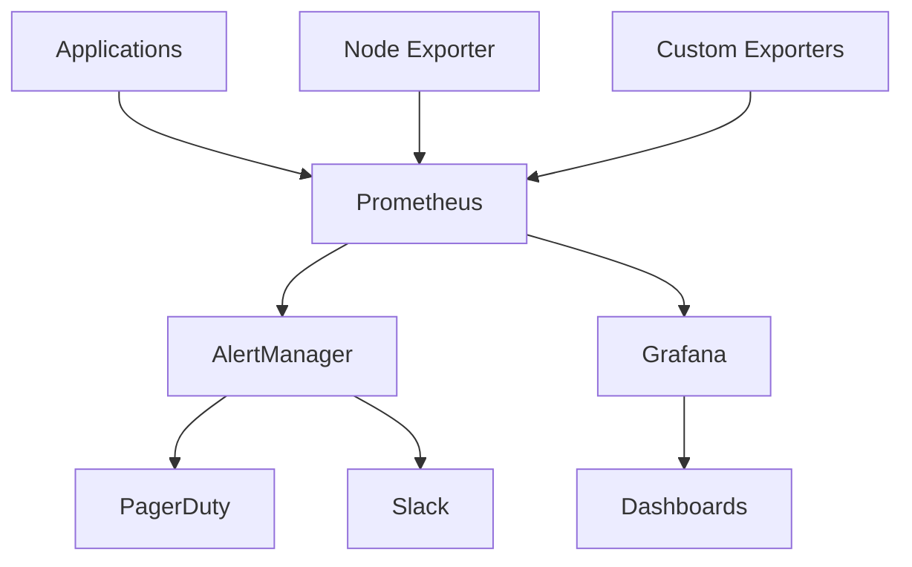

# Comprehensive Monitoring & Alerting

## 🎯 **Overview**

FootAnalytics platform implements comprehensive monitoring with Prometheus, Grafana, and AlertManager, providing real-time observability, SLO-based alerting, and performance insights across all services.

## 🏗️ **Architecture**

### Monitoring Stack
- **Prometheus**: Metrics collection and storage
- **Grafana**: Visualization and dashboards
- **AlertManager**: Alert routing and notification
- **Node Exporter**: System metrics
- **Custom Exporters**: Application-specific metrics

### Data Flow


## 🚀 **Installation & Configuration**

### Prerequisites
- Kubernetes cluster
- Helm 3.x
- Persistent storage for metrics

### Installation Steps

#### 1. Install Prometheus Stack
```bash
# Add Helm repository
helm repo add prometheus-community https://prometheus-community.github.io/helm-charts
helm repo update

# Install kube-prometheus-stack
helm upgrade --install prometheus prometheus-community/kube-prometheus-stack \
  --namespace monitoring \
  --create-namespace \
  --values infrastructure/k8s/monitoring/prometheus-values.yaml
```

#### 2. Apply Custom Configurations
```bash
# Apply SLO definitions
kubectl apply -f infrastructure/k8s/monitoring/slo-definitions.yaml

# Apply alerting rules
kubectl apply -f infrastructure/k8s/monitoring/alerting-rules.yaml

# Apply custom dashboards
kubectl apply -f infrastructure/k8s/grafana/dashboards/
```

#### 3. Verify Installation
```bash
# Check Prometheus pods
kubectl get pods -n monitoring

# Check services
kubectl get services -n monitoring

# Access Grafana
kubectl port-forward svc/grafana -n monitoring 3000:80
```

## 📊 **Key Metrics**

### Platform Metrics

#### Availability Metrics
```promql
# Platform availability (success rate)
(
  sum(rate(http_requests_total{job="api-gateway",code!~"5.."}[5m])) /
  sum(rate(http_requests_total{job="api-gateway"}[5m]))
) * 100

# Service uptime
up{job=~"api-gateway|video-ingestion|ml-pipeline|analytics-engine"}
```

#### Performance Metrics
```promql
# API response time P95
histogram_quantile(0.95,
  sum(rate(http_request_duration_seconds_bucket{job="api-gateway"}[5m])) by (le)
)

# Request rate
sum(rate(http_requests_total{job="api-gateway"}[5m]))

# Error rate
sum(rate(http_requests_total{job="api-gateway",code=~"5.."}[5m])) /
sum(rate(http_requests_total{job="api-gateway"}[5m])) * 100
```

### ML Pipeline Metrics

#### Inference Metrics
```promql
# ML inference latency P99
histogram_quantile(0.99,
  sum(rate(ml_inference_duration_seconds_bucket{job="ml-pipeline"}[5m])) by (le)
)

# GPU utilization
avg(nvidia_gpu_utilization_gpu{job="ml-pipeline"})

# Model accuracy
avg(ml_model_accuracy_score{job="ml-pipeline"}) * 100
```

#### Processing Metrics
```promql
# Video processing success rate
(
  sum(rate(video_processing_total{status="success"}[5m])) /
  sum(rate(video_processing_total[5m]))
) * 100

# Processing queue length
video_processing_queue_length

# Batch processing throughput
rate(video_processing_batches_total[5m])
```

### Infrastructure Metrics

#### Resource Utilization
```promql
# CPU utilization
100 - (avg by(instance) (irate(node_cpu_seconds_total{mode="idle"}[5m])) * 100)

# Memory utilization
(
  (node_memory_MemTotal_bytes - node_memory_MemAvailable_bytes) /
  node_memory_MemTotal_bytes
) * 100

# Disk utilization
(
  (node_filesystem_size_bytes - node_filesystem_avail_bytes) /
  node_filesystem_size_bytes
) * 100
```

#### Kubernetes Metrics
```promql
# Pod restart rate
rate(kube_pod_container_status_restarts_total[5m])

# Node readiness
kube_node_status_condition{condition="Ready",status="true"}

# Persistent volume usage
(
  kubelet_volume_stats_used_bytes /
  kubelet_volume_stats_capacity_bytes
) * 100
```

## 🔔 **Alerting Rules**

### Critical Alerts
<augment_code_snippet path="infrastructure/k8s/monitoring/alerting-rules.yaml" mode="EXCERPT">
````yaml
groups:
  - name: platform.critical
    interval: 30s
    rules:
      - alert: PlatformAvailabilityCritical
        expr: sli:platform_availability:rate5m < 0.99
        for: 2m
        labels:
          severity: critical
          service: platform
          team: engineering
          runbook: "https://runbooks.footanalytics.com/platform-availability"
        annotations:
          summary: "Platform availability is below SLO"
          description: "Platform availability is {{ $value | humanizePercentage }} which is below the 99% SLO for 2 minutes"
````
</augment_code_snippet>

### SLO Burn Rate Alerts
<augment_code_snippet path="infrastructure/k8s/monitoring/alerting-rules.yaml" mode="EXCERPT">
````yaml
  # Fast burn rate alerts (2% error budget in 1 hour)
  - alert: PlatformAvailabilityFastBurn
    expr: |
      (
        (1 - sli:platform_availability:rate5m) / (1 - 0.999)
      ) > 14.4
    for: 2m
    labels:
      severity: critical
      service: platform
      team: engineering
      alert_type: slo_burn_rate
      burn_rate: fast
    annotations:
      summary: "Platform availability SLO fast burn rate"
      description: "Platform is burning through error budget at 14.4x rate"
````
</augment_code_snippet>

### ML Pipeline Alerts
```yaml
groups:
  - name: ml-pipeline.critical
    rules:
      - alert: MLInferenceLatencyHigh
        expr: sli:ml_inference_latency:p99_5m > 2.0
        for: 5m
        labels:
          severity: critical
          service: ml-pipeline
          team: ml-engineering
        annotations:
          summary: "ML inference latency is above SLO"
          description: "ML inference P99 latency is {{ $value | humanizeDuration }}"

      - alert: GPUUtilizationLow
        expr: sli:gpu_utilization:avg5m < 0.3
        for: 30m
        labels:
          severity: warning
          service: ml-pipeline
        annotations:
          summary: "GPU utilization is low"
          description: "GPU utilization is {{ $value | humanizePercentage }}"
```

## 📈 **Dashboards**

### Platform Overview Dashboard
<augment_code_snippet path="infrastructure/k8s/grafana/dashboards/platform-overview-dashboard.json" mode="EXCERPT">
````json
{
  "dashboard": {
    "title": "FootAnalytics Platform Overview",
    "panels": [
      {
        "title": "Platform Health Score",
        "type": "stat",
        "targets": [
          {
            "expr": "sli:platform_availability:rate5m * 100",
            "legendFormat": "Availability %"
          }
        ],
        "fieldConfig": {
          "defaults": {
            "thresholds": {
              "steps": [
                {"color": "red", "value": 0},
                {"color": "yellow", "value": 95},
                {"color": "green", "value": 99}
              ]
            }
          }
        }
      }
    ]
  }
}
````
</augment_code_snippet>

### Custom Dashboard Creation
```yaml
# Dashboard ConfigMap
apiVersion: v1
kind: ConfigMap
metadata:
  name: custom-dashboard
  namespace: monitoring
  labels:
    grafana_dashboard: "1"
data:
  dashboard.json: |
    {
      "dashboard": {
        "title": "Custom Service Dashboard",
        "panels": [
          {
            "title": "Request Rate",
            "type": "graph",
            "targets": [
              {
                "expr": "rate(http_requests_total[5m])",
                "legendFormat": "{{method}} {{status}}"
              }
            ]
          }
        ]
      }
    }
```

## 🎯 **SLO/SLI Management**

### SLO Definitions
<augment_code_snippet path="infrastructure/k8s/monitoring/slo-definitions.yaml" mode="EXCERPT">
````yaml
data:
  platform-slos.yaml: |
    # Platform-wide SLOs
    slos:
      - name: platform_availability
        description: "Platform overall availability"
        sli:
          type: availability
          query: |
            (
              sum(rate(http_requests_total{job="api-gateway",code!~"5.."}[5m])) /
              sum(rate(http_requests_total{job="api-gateway"}[5m]))
            ) * 100
        objectives:
          - target: 99.9   # 99.9% availability
            window: 30d    # 30-day rolling window
````
</augment_code_snippet>

### Recording Rules
```yaml
groups:
  - name: slo.rules
    interval: 30s
    rules:
      # Platform Availability SLI
      - record: sli:platform_availability:rate5m
        expr: |
          (
            sum(rate(http_requests_total{job="api-gateway",code!~"5.."}[5m])) /
            sum(rate(http_requests_total{job="api-gateway"}[5m]))
          )

      # Error Budget Calculations
      - record: slo:platform_availability:error_budget_remaining
        expr: |
          1 - (
            (1 - sli:platform_availability:rate5m) /
            (1 - 0.999)  # 99.9% target
          )
```

## 🔧 **Custom Metrics**

### Application Metrics

#### Business Metrics
```typescript
// Business metrics in Node.js
import { register, Counter, Histogram, Gauge } from 'prom-client';

// User session metrics
const userSessions = new Counter({
  name: 'user_sessions_total',
  help: 'Total number of user sessions',
  labelNames: ['status', 'plan', 'country'],
});

// Video upload metrics
const videoUploads = new Counter({
  name: 'video_uploads_total',
  help: 'Total number of video uploads',
  labelNames: ['status', 'format', 'size_category'],
});

// Analytics generation time
const analyticsGeneration = new Histogram({
  name: 'analytics_generation_duration_seconds',
  help: 'Time to generate analytics',
  labelNames: ['video_type', 'complexity'],
  buckets: [1, 5, 10, 30, 60, 300, 600],
});

// Usage example
userSessions.inc({ status: 'completed', plan: 'premium', country: 'IL' });
videoUploads.inc({ status: 'success', format: 'mp4', size_category: 'large' });
analyticsGeneration.observe({ video_type: 'match', complexity: 'high' }, 45.2);
```

#### ML Pipeline Metrics
```python
# ML metrics in Python
from prometheus_client import Counter, Histogram, Gauge, start_http_server

# Model inference metrics
inference_duration = Histogram(
    'ml_inference_duration_seconds',
    'ML model inference duration',
    ['model_version', 'batch_size', 'device']
)

model_accuracy = Gauge(
    'ml_model_accuracy_score',
    'ML model accuracy score',
    ['model_version', 'dataset']
)

gpu_memory_usage = Gauge(
    'gpu_memory_usage_bytes',
    'GPU memory usage in bytes',
    ['gpu_id', 'process']
)

# Usage example
with inference_duration.labels(
    model_version='v2',
    batch_size='32',
    device='cuda'
).time():
    result = model.predict(batch)

model_accuracy.labels(model_version='v2', dataset='validation').set(0.87)
```

### Infrastructure Metrics

#### Custom Exporters
```go
// Custom exporter in Go
package main

import (
    "github.com/prometheus/client_golang/prometheus"
    "github.com/prometheus/client_golang/prometheus/promhttp"
)

var (
    queueLength = prometheus.NewGaugeVec(
        prometheus.GaugeOpts{
            Name: "video_processing_queue_length",
            Help: "Number of videos in processing queue",
        },
        []string{"queue_type", "priority"},
    )
    
    processingBatches = prometheus.NewCounterVec(
        prometheus.CounterOpts{
            Name: "video_processing_batches_total",
            Help: "Total number of processing batches",
        },
        []string{"status", "batch_size"},
    )
)

func init() {
    prometheus.MustRegister(queueLength)
    prometheus.MustRegister(processingBatches)
}
```

## 🔍 **Monitoring Best Practices**

### Metric Design
1. **Meaningful Names**: Use descriptive metric names
2. **Consistent Labels**: Standardize label naming across services
3. **Cardinality Control**: Avoid high-cardinality labels
4. **Unit Conventions**: Use standard units (seconds, bytes, etc.)

### Dashboard Design
1. **User-Centric**: Design for specific user personas
2. **Hierarchical**: Start with overview, drill down to details
3. **Actionable**: Include links to runbooks and remediation
4. **Performance**: Optimize queries for dashboard load times

### Alert Design
1. **Actionable**: Only alert on actionable conditions
2. **Severity Levels**: Use appropriate severity classifications
3. **Context**: Include relevant context in alert messages
4. **Runbooks**: Link to specific remediation procedures

## 🛠️ **Troubleshooting**

### Common Issues

#### 1. High Cardinality Metrics
```bash
# Check metric cardinality
curl http://prometheus:9090/api/v1/label/__name__/values | jq '.data | length'

# Find high cardinality metrics
curl http://prometheus:9090/api/v1/query?query=prometheus_tsdb_symbol_table_size_bytes

# Identify problematic labels
curl http://prometheus:9090/api/v1/series?match[]={__name__=~".+"}
```

#### 2. Missing Metrics
```bash
# Check service discovery
curl http://prometheus:9090/api/v1/targets

# Verify scrape configs
kubectl get prometheus -o yaml | grep -A 20 scrapeConfigs

# Check service monitors
kubectl get servicemonitor -A
```

#### 3. Alert Fatigue
```bash
# Check alert frequency
curl http://alertmanager:9093/api/v1/alerts

# Analyze alert patterns
kubectl logs -n monitoring deployment/alertmanager | grep -c "firing"
```

### Debugging Commands
```bash
# Check Prometheus status
kubectl exec -n monitoring prometheus-prometheus-0 -- \
  promtool query instant 'up'

# Validate recording rules
kubectl exec -n monitoring prometheus-prometheus-0 -- \
  promtool check rules /etc/prometheus/rules/*.yml

# Test alert rules
kubectl exec -n monitoring prometheus-prometheus-0 -- \
  promtool test rules /etc/prometheus/test/*.yml
```

## 📋 **Maintenance**

### Regular Tasks
1. **Metric Cleanup**: Remove unused metrics and labels
2. **Dashboard Updates**: Keep dashboards current with system changes
3. **Alert Tuning**: Adjust thresholds based on historical data
4. **Storage Management**: Monitor and manage metric storage

### Performance Optimization
1. **Query Optimization**: Use recording rules for complex queries
2. **Retention Policies**: Configure appropriate data retention
3. **Scrape Intervals**: Optimize scrape frequencies
4. **Resource Allocation**: Right-size Prometheus resources

---

**Next Steps**: [SLO/SLI Management](./SLO_SLI.md) | [Incident Response](../incident-response/INCIDENT_RESPONSE.md)
