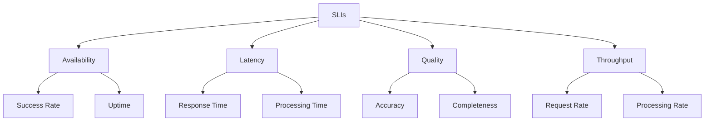

# SLO/SLI Management

## 🎯 **Overview**

Service Level Objectives (SLOs) and Service Level Indicators (SLIs) provide measurable targets for FootAnalytics platform reliability, enabling data-driven decisions about system performance and user experience.

## 📊 **SLO/SLI Framework**

### Definitions
- **SLI (Service Level Indicator)**: A quantitative measure of service performance
- **SLO (Service Level Objective)**: Target value or range for an SLI
- **SLA (Service Level Agreement)**: Business agreement based on SLOs
- **Error Budget**: Allowed unreliability (100% - SLO)

### SLI Categories


## 🎯 **Platform SLOs**

### Core Platform SLOs

#### Availability SLO
<augment_code_snippet path="infrastructure/k8s/monitoring/slo-definitions.yaml" mode="EXCERPT">
````yaml
slos:
  - name: platform_availability
    description: "Platform overall availability"
    sli:
      type: availability
      query: |
        (
          sum(rate(http_requests_total{job="api-gateway",code!~"5.."}[5m])) /
          sum(rate(http_requests_total{job="api-gateway"}[5m]))
        ) * 100
    objectives:
      - target: 99.9   # 99.9% availability
        window: 30d    # 30-day rolling window
      - target: 99.5   # 99.5% availability
        window: 7d     # 7-day rolling window
````
</augment_code_snippet>

#### Latency SLO
```yaml
- name: api_response_time
  description: "API Gateway response time P95"
  sli:
    type: latency
    query: |
      histogram_quantile(0.95,
        sum(rate(http_request_duration_seconds_bucket{job="api-gateway"}[5m])) by (le)
      ) * 1000
  objectives:
    - target: 200    # 200ms P95 latency
      window: 30d
    - target: 150    # 150ms P95 latency
      window: 7d
```

### ML Pipeline SLOs

#### Inference Latency SLO
```yaml
- name: ml_inference_latency
  description: "ML model inference latency P99"
  sli:
    type: latency
    query: |
      histogram_quantile(0.99,
        sum(rate(ml_inference_duration_seconds_bucket{job="ml-pipeline"}[5m])) by (le)
      ) * 1000
  objectives:
    - target: 2000   # 2 seconds P99 latency
      window: 30d
    - target: 1500   # 1.5 seconds P99 latency
      window: 7d
```

#### Model Accuracy SLO
```yaml
- name: model_accuracy
  description: "ML model prediction accuracy"
  sli:
    type: quality
    query: |
      avg(ml_model_accuracy_score{job="ml-pipeline"}) * 100
  objectives:
    - target: 85.0   # 85% accuracy
      window: 30d
    - target: 87.0   # 87% accuracy
      window: 7d
```

### Business SLOs

#### User Experience SLO
```yaml
- name: user_session_success_rate
  description: "User session completion success rate"
  sli:
    type: availability
    query: |
      (
        sum(rate(user_sessions_total{status="completed"}[5m])) /
        sum(rate(user_sessions_total[5m]))
      ) * 100
  objectives:
    - target: 95.0   # 95% session success rate
      window: 30d
    - target: 97.0   # 97% session success rate
      window: 7d
```

#### Video Processing SLO
```yaml
- name: video_processing_success_rate
  description: "Video processing success rate"
  sli:
    type: availability
    query: |
      (
        sum(rate(video_processing_total{status="success"}[5m])) /
        sum(rate(video_processing_total[5m]))
      ) * 100
  objectives:
    - target: 95.0   # 95% success rate
      window: 30d
    - target: 98.0   # 98% success rate
      window: 7d
```

## 📈 **Error Budget Management**

### Error Budget Calculation
```yaml
# Error budget recording rules
groups:
  - name: error_budget.rules
    interval: 30s
    rules:
      # Platform availability error budget
      - record: slo:platform_availability:error_budget_remaining
        expr: |
          1 - (
            (1 - sli:platform_availability:rate5m) /
            (1 - 0.999)  # 99.9% target
          )
      
      # API latency error budget
      - record: slo:api_response_time:error_budget_remaining
        expr: |
          1 - (
            (sli:api_response_time:p95_5m - 0.2) /  # 200ms target
            (2.0 - 0.2)  # Max acceptable latency
          )
```

### Burn Rate Alerting
```yaml
# Fast burn rate (2% error budget in 1 hour)
- alert: PlatformAvailabilityFastBurn
  expr: |
    (
      (1 - sli:platform_availability:rate5m) / (1 - 0.999)
    ) > 14.4
  for: 2m
  labels:
    severity: critical
    burn_rate: fast
  annotations:
    summary: "Platform availability SLO fast burn rate"
    description: "Burning error budget at 14.4x rate"

# Slow burn rate (5% error budget in 6 hours)
- alert: PlatformAvailabilitySlowBurn
  expr: |
    (
      (1 - sli:platform_availability:rate5m) / (1 - 0.999)
    ) > 6
  for: 15m
  labels:
    severity: warning
    burn_rate: slow
  annotations:
    summary: "Platform availability SLO slow burn rate"
    description: "Burning error budget at 6x rate"
```

## 🔍 **SLI Implementation**

### Recording Rules
<augment_code_snippet path="infrastructure/k8s/monitoring/slo-definitions.yaml" mode="EXCERPT">
````yaml
groups:
  - name: slo.rules
    interval: 30s
    rules:
      # Platform Availability SLI
      - record: sli:platform_availability:rate5m
        expr: |
          (
            sum(rate(http_requests_total{job="api-gateway",code!~"5.."}[5m])) /
            sum(rate(http_requests_total{job="api-gateway"}[5m]))
          )

      # API Response Time SLI
      - record: sli:api_response_time:p95_5m
        expr: |
          histogram_quantile(0.95,
            sum(rate(http_request_duration_seconds_bucket{job="api-gateway"}[5m])) by (le)
          )
````
</augment_code_snippet>

### Custom SLI Metrics

#### Application-Level SLIs
```typescript
// Custom SLI metrics in Node.js
import { Histogram, Counter } from 'prom-client';

// User journey completion SLI
const userJourneyCompletion = new Counter({
  name: 'user_journey_completion_total',
  help: 'User journey completion events',
  labelNames: ['journey_type', 'status', 'user_segment'],
});

// Video analysis quality SLI
const videoAnalysisQuality = new Histogram({
  name: 'video_analysis_quality_score',
  help: 'Video analysis quality score',
  labelNames: ['analysis_type', 'video_category'],
  buckets: [0.5, 0.6, 0.7, 0.8, 0.85, 0.9, 0.95, 1.0],
});

// Usage
userJourneyCompletion.inc({
  journey_type: 'video_upload_to_analysis',
  status: 'completed',
  user_segment: 'premium'
});

videoAnalysisQuality.observe({
  analysis_type: 'tactical_analysis',
  video_category: 'match'
}, 0.87);
```

#### Infrastructure SLIs
```python
# Infrastructure SLI metrics in Python
from prometheus_client import Gauge, Counter

# Service dependency health SLI
service_dependency_health = Gauge(
    'service_dependency_health_score',
    'Service dependency health score',
    ['service', 'dependency', 'environment']
)

# Data pipeline freshness SLI
data_pipeline_freshness = Gauge(
    'data_pipeline_freshness_seconds',
    'Data pipeline freshness in seconds',
    ['pipeline', 'stage', 'data_type']
)

# Usage
service_dependency_health.labels(
    service='api-gateway',
    dependency='database',
    environment='production'
).set(0.99)

data_pipeline_freshness.labels(
    pipeline='video_processing',
    stage='feature_extraction',
    data_type='tactical_data'
).set(45.2)
```

## 📊 **SLO Dashboards**

### SLO Overview Dashboard
```json
{
  "dashboard": {
    "title": "SLO Overview",
    "panels": [
      {
        "title": "SLO Compliance",
        "type": "stat",
        "targets": [
          {
            "expr": "sli:platform_availability:rate5m * 100",
            "legendFormat": "Platform Availability"
          },
          {
            "expr": "100 - (sli:api_response_time:p95_5m * 1000 / 200 * 100)",
            "legendFormat": "API Latency"
          }
        ],
        "fieldConfig": {
          "defaults": {
            "thresholds": {
              "steps": [
                {"color": "red", "value": 0},
                {"color": "yellow", "value": 95},
                {"color": "green", "value": 99}
              ]
            },
            "unit": "percent"
          }
        }
      },
      {
        "title": "Error Budget Burn Rate",
        "type": "timeseries",
        "targets": [
          {
            "expr": "(1 - sli:platform_availability:rate5m) / (1 - 0.999)",
            "legendFormat": "Platform Availability Burn Rate"
          },
          {
            "expr": "(sli:api_response_time:p95_5m - 0.2) / (2.0 - 0.2)",
            "legendFormat": "API Latency Burn Rate"
          }
        ],
        "fieldConfig": {
          "defaults": {
            "custom": {
              "thresholdsStyle": {
                "mode": "line"
              }
            },
            "thresholds": {
              "steps": [
                {"color": "green", "value": 0},
                {"color": "yellow", "value": 1},
                {"color": "red", "value": 6}
              ]
            }
          }
        }
      }
    ]
  }
}
```

### Error Budget Dashboard
```json
{
  "dashboard": {
    "title": "Error Budget Management",
    "panels": [
      {
        "title": "Error Budget Remaining",
        "type": "bargauge",
        "targets": [
          {
            "expr": "slo:platform_availability:error_budget_remaining * 100",
            "legendFormat": "Platform Availability"
          },
          {
            "expr": "slo:api_response_time:error_budget_remaining * 100",
            "legendFormat": "API Latency"
          }
        ],
        "fieldConfig": {
          "defaults": {
            "thresholds": {
              "steps": [
                {"color": "red", "value": 0},
                {"color": "yellow", "value": 20},
                {"color": "green", "value": 50}
              ]
            },
            "unit": "percent",
            "min": 0,
            "max": 100
          }
        }
      }
    ]
  }
}
```

## 🎯 **SLO Review Process**

### Weekly SLO Review
```yaml
# Weekly SLO review checklist
weekly_review:
  metrics_to_review:
    - platform_availability
    - api_response_time
    - ml_inference_latency
    - video_processing_success_rate
  
  questions:
    - "Are we meeting our SLO targets?"
    - "How much error budget have we consumed?"
    - "What caused any SLO violations?"
    - "Do we need to adjust SLO targets?"
    - "Are our SLIs still relevant?"
  
  actions:
    - Update SLO targets if needed
    - Adjust alerting thresholds
    - Plan reliability improvements
    - Communicate with stakeholders
```

### Monthly SLO Planning
```yaml
# Monthly SLO planning process
monthly_planning:
  review_scope:
    - Historical SLO performance
    - Error budget consumption patterns
    - User impact correlation
    - Business requirements changes
  
  deliverables:
    - SLO performance report
    - Error budget analysis
    - Reliability roadmap updates
    - Stakeholder communication
```

## 🔧 **SLO Automation**

### Automated SLO Reporting
```python
# Automated SLO report generation
import requests
import json
from datetime import datetime, timedelta

class SLOReporter:
    def __init__(self, prometheus_url):
        self.prometheus_url = prometheus_url
    
    def get_slo_compliance(self, sli_query, target, window='30d'):
        """Calculate SLO compliance for given SLI"""
        query = f"avg_over_time({sli_query}[{window}])"
        response = requests.get(
            f"{self.prometheus_url}/api/v1/query",
            params={'query': query}
        )
        
        result = response.json()
        if result['data']['result']:
            value = float(result['data']['result'][0]['value'][1])
            compliance = (value >= target)
            return {
                'sli_value': value,
                'target': target,
                'compliance': compliance,
                'error_budget_consumed': max(0, (target - value) / (1 - target))
            }
        return None
    
    def generate_report(self):
        """Generate comprehensive SLO report"""
        slos = [
            {
                'name': 'Platform Availability',
                'query': 'sli:platform_availability:rate5m',
                'target': 0.999
            },
            {
                'name': 'API Response Time',
                'query': '1 - (sli:api_response_time:p95_5m / 0.2)',
                'target': 0.95
            }
        ]
        
        report = {
            'timestamp': datetime.now().isoformat(),
            'period': '30d',
            'slos': []
        }
        
        for slo in slos:
            compliance = self.get_slo_compliance(
                slo['query'], 
                slo['target']
            )
            if compliance:
                report['slos'].append({
                    'name': slo['name'],
                    **compliance
                })
        
        return report
```

### SLO-based Deployment Gates
```yaml
# GitLab CI/CD SLO gate
slo_gate:
  stage: deploy
  script:
    - |
      # Check current SLO compliance
      AVAILABILITY=$(curl -s "http://prometheus:9090/api/v1/query?query=sli:platform_availability:rate5m" | jq -r '.data.result[0].value[1]')
      
      if (( $(echo "$AVAILABILITY < 0.995" | bc -l) )); then
        echo "SLO violation detected. Availability: $AVAILABILITY"
        echo "Blocking deployment to preserve error budget"
        exit 1
      fi
      
      echo "SLO compliance verified. Proceeding with deployment"
  only:
    - main
```

## 🛠️ **Troubleshooting SLOs**

### Common Issues

#### 1. SLI Data Quality
```bash
# Check SLI data availability
curl "http://prometheus:9090/api/v1/query?query=sli:platform_availability:rate5m"

# Verify recording rule execution
kubectl logs -n monitoring prometheus-prometheus-0 | grep "recording rule"

# Check for missing metrics
curl "http://prometheus:9090/api/v1/query?query=up{job='api-gateway'}"
```

#### 2. SLO Target Validation
```promql
# Analyze historical performance
quantile_over_time(0.95, sli:platform_availability:rate5m[30d])

# Check error budget consumption rate
rate(slo:platform_availability:error_budget_consumed[7d])

# Validate SLO achievability
histogram_quantile(0.99, 
  rate(http_request_duration_seconds_bucket{job="api-gateway"}[30d])
)
```

#### 3. Alert Tuning
```yaml
# Test alert expressions
expr: |
  (
    (1 - sli:platform_availability:rate5m) / (1 - 0.999)
  ) > 14.4

# Validate burn rate calculations
expr: |
  increase(slo:platform_availability:error_budget_consumed[1h]) > 0.02
```

## 📋 **Best Practices**

### SLO Design
1. **User-Centric**: Focus on user-visible metrics
2. **Achievable**: Set realistic targets based on historical data
3. **Measurable**: Use precise, unambiguous definitions
4. **Actionable**: Enable clear remediation actions

### SLI Selection
1. **Coverage**: Cover all critical user journeys
2. **Sensitivity**: Detect meaningful changes in user experience
3. **Proportionality**: Weight by business impact
4. **Freshness**: Use recent data for decision making

### Error Budget Management
1. **Transparency**: Share error budget status with all stakeholders
2. **Prioritization**: Use error budget to prioritize reliability work
3. **Trade-offs**: Balance feature velocity with reliability
4. **Learning**: Use budget exhaustion as learning opportunities

---

**Next Steps**: [Incident Response](../incident-response/INCIDENT_RESPONSE.md) | [Chaos Engineering](../chaos-engineering/CHAOS_ENGINEERING.md)
