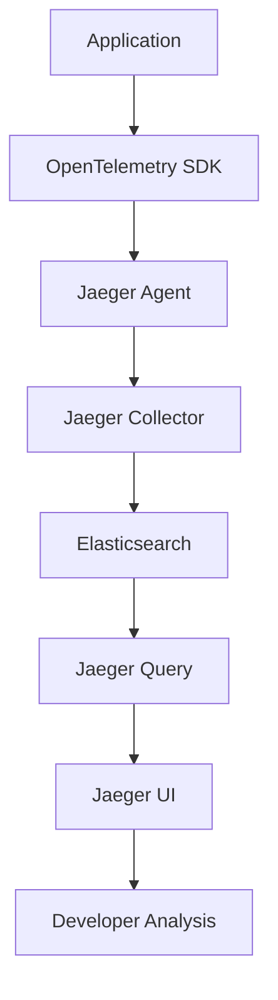

# Distributed Tracing with Jaeger

## 🎯 **Overview**

Jaeger provides distributed tracing for FootAnalytics platform, enabling end-to-end observability across microservices, performance monitoring, and root cause analysis for complex distributed systems.

## 🏗️ **Architecture**

### Components
- **Jaeger Agent**: Collects traces from applications
- **Jaeger Collector**: Receives traces and writes to storage
- **Jaeger Query**: Serves traces to UI and API
- **Elasticsearch**: Persistent trace storage
- **Jaeger UI**: Web interface for trace visualization

### Tracing Flow


## 🚀 **Installation & Configuration**

### Prerequisites
- Kubernetes cluster
- Elasticsearch for storage
- OpenTelemetry instrumentation

### Installation Steps

#### 1. Deploy using Terraform
```bash
cd infrastructure/terraform
terraform apply -target=module.jaeger
```

#### 2. Verify Installation
```bash
# Check Jaeger pods
kubectl get pods -n jaeger

# Check services
kubectl get services -n jaeger

# Check Jaeger operator
kubectl get jaeger -n jaeger
```

#### 3. Access Jaeger UI
```bash
# Port forward for local access
kubectl port-forward svc/jaeger-production-query -n jaeger 16686:16686

# Access UI at http://localhost:16686
```

### Configuration Files

#### Jaeger Production Instance
<augment_code_snippet path="infrastructure/terraform/modules/jaeger/main.tf" mode="EXCERPT">
````terraform
# Jaeger Production Instance
resource "kubernetes_manifest" "jaeger_production" {
  manifest = {
    apiVersion = "jaegertracing.io/v1"
    kind       = "Jaeger"
    metadata = {
      name      = "jaeger-production"
      namespace = kubernetes_namespace.jaeger.metadata[0].name
    }
    spec = {
      strategy = "production"
      
      # Storage configuration using Elasticsearch
      storage = {
        type = "elasticsearch"
        options = {
          es = {
            "server-urls" = "http://elasticsearch.jaeger:9200"
            "index-prefix" = "jaeger"
            "num-shards" = "3"
            "num-replicas" = "1"
          }
        }
      }
````
</augment_code_snippet>

## 📊 **OpenTelemetry Integration**

### Node.js/TypeScript Setup

#### Installation
```bash
npm install @opentelemetry/api @opentelemetry/sdk-node @opentelemetry/exporter-jaeger
```

#### Configuration
```typescript
// src/tracing.ts
import { NodeSDK } from '@opentelemetry/sdk-node';
import { JaegerExporter } from '@opentelemetry/exporter-jaeger';
import { getNodeAutoInstrumentations } from '@opentelemetry/auto-instrumentations-node';

const jaegerExporter = new JaegerExporter({
  endpoint: 'http://jaeger-production-collector.jaeger:14268/api/traces',
});

const sdk = new NodeSDK({
  traceExporter: jaegerExporter,
  instrumentations: [getNodeAutoInstrumentations()],
  serviceName: 'api-gateway',
  serviceVersion: '1.2.3',
});

sdk.start();
```

#### Custom Spans
```typescript
// src/services/videoService.ts
import { trace, SpanStatusCode } from '@opentelemetry/api';

const tracer = trace.getTracer('video-service', '1.0.0');

export class VideoService {
  async processVideo(videoId: string): Promise<void> {
    const span = tracer.startSpan('video.process', {
      attributes: {
        'video.id': videoId,
        'service.name': 'video-ingestion',
      },
    });

    try {
      // Add custom attributes
      span.setAttributes({
        'video.size': await this.getVideoSize(videoId),
        'video.format': await this.getVideoFormat(videoId),
      });

      // Process video
      await this.uploadToS3(videoId);
      await this.extractMetadata(videoId);
      await this.triggerMLPipeline(videoId);

      span.setStatus({ code: SpanStatusCode.OK });
    } catch (error) {
      span.setStatus({
        code: SpanStatusCode.ERROR,
        message: error.message,
      });
      span.recordException(error);
      throw error;
    } finally {
      span.end();
    }
  }

  private async uploadToS3(videoId: string): Promise<void> {
    const span = tracer.startSpan('video.upload.s3', {
      parent: trace.getActiveSpan(),
      attributes: {
        'aws.service': 's3',
        'aws.bucket': 'footanalytics-videos',
      },
    });

    try {
      // S3 upload logic
      await this.s3Client.upload(videoId);
      span.setStatus({ code: SpanStatusCode.OK });
    } catch (error) {
      span.setStatus({
        code: SpanStatusCode.ERROR,
        message: error.message,
      });
      throw error;
    } finally {
      span.end();
    }
  }
}
```

### Python Setup (ML Pipeline)

#### Installation
```bash
pip install opentelemetry-api opentelemetry-sdk opentelemetry-exporter-jaeger
```

#### Configuration
```python
# ml_pipeline/tracing.py
from opentelemetry import trace
from opentelemetry.sdk.trace import TracerProvider
from opentelemetry.sdk.trace.export import BatchSpanProcessor
from opentelemetry.exporter.jaeger.thrift import JaegerExporter
from opentelemetry.instrumentation.requests import RequestsInstrumentor
from opentelemetry.instrumentation.psycopg2 import Psycopg2Instrumentor

# Configure tracer
trace.set_tracer_provider(TracerProvider())
tracer = trace.get_tracer(__name__)

# Configure Jaeger exporter
jaeger_exporter = JaegerExporter(
    agent_host_name="jaeger-production-agent.jaeger",
    agent_port=6831,
)

span_processor = BatchSpanProcessor(jaeger_exporter)
trace.get_tracer_provider().add_span_processor(span_processor)

# Auto-instrument libraries
RequestsInstrumentor().instrument()
Psycopg2Instrumentor().instrument()
```

#### Custom Spans in ML Pipeline
```python
# ml_pipeline/inference.py
from opentelemetry import trace
from opentelemetry.trace import Status, StatusCode

tracer = trace.get_tracer(__name__)

class MLInferenceEngine:
    async def predict(self, video_data, model_version='v1'):
        with tracer.start_as_current_span("ml.inference") as span:
            span.set_attributes({
                "ml.model.version": model_version,
                "ml.input.size": len(video_data),
                "ml.framework": "pytorch",
            })
            
            try:
                # Preprocessing
                with tracer.start_as_current_span("ml.preprocessing") as prep_span:
                    prep_span.set_attribute("preprocessing.method", "resize_normalize")
                    processed_data = await self.preprocess(video_data)
                    prep_span.set_attribute("preprocessing.output_size", len(processed_data))
                
                # Model inference
                with tracer.start_as_current_span("ml.model.inference") as inf_span:
                    inf_span.set_attributes({
                        "ml.model.name": f"football_analysis_{model_version}",
                        "ml.batch_size": self.batch_size,
                        "ml.device": "cuda" if self.use_gpu else "cpu",
                    })
                    
                    predictions = await self.model.predict(processed_data)
                    
                    inf_span.set_attributes({
                        "ml.predictions.count": len(predictions),
                        "ml.confidence.avg": np.mean([p.confidence for p in predictions]),
                    })
                
                # Postprocessing
                with tracer.start_as_current_span("ml.postprocessing") as post_span:
                    results = await self.postprocess(predictions)
                    post_span.set_attribute("postprocessing.results_count", len(results))
                
                span.set_status(Status(StatusCode.OK))
                return results
                
            except Exception as e:
                span.set_status(Status(StatusCode.ERROR, str(e)))
                span.record_exception(e)
                raise
```

## 🔍 **Trace Analysis**

### Key Metrics

#### Latency Analysis
```bash
# Query traces by latency
curl "http://jaeger-query:16686/api/traces?service=api-gateway&minDuration=1s"

# Find slow operations
curl "http://jaeger-query:16686/api/traces?service=ml-pipeline&operation=ml.inference&minDuration=5s"
```

#### Error Analysis
```bash
# Find traces with errors
curl "http://jaeger-query:16686/api/traces?service=video-ingestion&tags=error:true"

# Analyze error patterns
curl "http://jaeger-query:16686/api/traces?tags=http.status_code:500"
```

### Trace Correlation

#### Request ID Propagation
```typescript
// Middleware to propagate request ID
app.use((req, res, next) => {
  const requestId = req.headers['x-request-id'] || uuidv4();
  const span = trace.getActiveSpan();
  
  if (span) {
    span.setAttributes({
      'request.id': requestId,
      'user.id': req.user?.id,
      'session.id': req.session?.id,
    });
  }
  
  res.setHeader('x-request-id', requestId);
  next();
});
```

#### Cross-Service Correlation
```python
# Propagate trace context between services
import requests
from opentelemetry.propagate import inject

headers = {}
inject(headers)  # Inject trace context

response = requests.post(
    "http://ml-pipeline:8000/predict",
    json=payload,
    headers=headers
)
```

## 📈 **Performance Monitoring**

### Service Dependencies
```yaml
# Service dependency mapping
dependencies:
  api-gateway:
    - video-ingestion
    - analytics-engine
    - user-management
  
  video-ingestion:
    - ml-pipeline
    - s3-storage
    - database
  
  ml-pipeline:
    - gpu-cluster
    - model-storage
    - result-cache
```

### SLI/SLO Integration
```typescript
// Track SLI metrics from traces
const traceSLI = {
  async recordLatency(span: Span) {
    const duration = span.duration;
    const operation = span.operationName;
    
    // Record P95 latency
    latencyHistogram.observe(
      { service: span.process.serviceName, operation },
      duration / 1000 // Convert to seconds
    );
  },
  
  async recordErrors(span: Span) {
    if (span.tags.error) {
      errorCounter.inc({
        service: span.process.serviceName,
        operation: span.operationName,
        error_type: span.tags['error.type'],
      });
    }
  },
};
```

### Alerting on Traces
```yaml
# Prometheus alerts based on trace data
groups:
  - name: jaeger.rules
    rules:
      - alert: HighTraceLatency
        expr: histogram_quantile(0.95, jaeger_trace_duration_seconds) > 5
        for: 5m
        labels:
          severity: warning
        annotations:
          summary: "High trace latency detected"
          
      - alert: TraceErrorRate
        expr: rate(jaeger_trace_errors_total[5m]) / rate(jaeger_traces_total[5m]) > 0.05
        for: 2m
        labels:
          severity: critical
        annotations:
          summary: "High trace error rate"
```

## 🔧 **Sampling Strategies**

### Adaptive Sampling
```yaml
# Jaeger sampling configuration
sampling:
  default_strategy:
    type: adaptive
    max_traces_per_second: 100
  
  per_service_strategies:
    - service: "api-gateway"
      type: probabilistic
      param: 0.1  # 10% sampling
    
    - service: "ml-pipeline"
      type: adaptive
      max_traces_per_second: 50
    
    - service: "video-ingestion"
      type: rate_limiting
      max_traces_per_second: 20
```

### Custom Sampling
```typescript
// Custom sampling logic
const customSampler = {
  shouldSample(context: any): boolean {
    // Always sample errors
    if (context.attributes['error']) {
      return true;
    }
    
    // Sample slow requests
    if (context.attributes['http.duration'] > 1000) {
      return true;
    }
    
    // Sample premium users more frequently
    if (context.attributes['user.plan'] === 'premium') {
      return Math.random() < 0.5; // 50% sampling
    }
    
    // Default sampling
    return Math.random() < 0.1; // 10% sampling
  },
};
```

## 🛠️ **Troubleshooting**

### Common Issues

#### 1. Missing Traces
```bash
# Check agent connectivity
kubectl exec -n jaeger deployment/jaeger-production-agent -- \
  netstat -an | grep 14268

# Verify collector health
kubectl logs -n jaeger deployment/jaeger-production-collector

# Check application instrumentation
curl http://api-gateway:4000/metrics | grep jaeger
```

#### 2. High Storage Usage
```bash
# Check Elasticsearch indices
kubectl exec -n jaeger deployment/elasticsearch -- \
  curl -X GET "localhost:9200/_cat/indices/jaeger*?v"

# Clean old traces
kubectl exec -n jaeger deployment/elasticsearch -- \
  curl -X DELETE "localhost:9200/jaeger-span-$(date -d '7 days ago' +%Y-%m-%d)"
```

#### 3. Performance Issues
```bash
# Check collector metrics
kubectl port-forward -n jaeger svc/jaeger-production-collector 14269:14269
curl http://localhost:14269/metrics

# Monitor queue sizes
kubectl logs -n jaeger deployment/jaeger-production-collector | grep queue
```

### Debugging Commands
```bash
# View Jaeger operator logs
kubectl logs -n jaeger deployment/jaeger-operator

# Check trace ingestion rate
kubectl exec -n jaeger deployment/jaeger-production-collector -- \
  curl http://localhost:14269/metrics | grep jaeger_collector_traces_received_total

# Verify storage connectivity
kubectl exec -n jaeger deployment/jaeger-production-query -- \
  curl http://elasticsearch:9200/_cluster/health
```

## 📋 **Best Practices**

### Instrumentation
1. **Meaningful Span Names**: Use descriptive operation names
2. **Rich Attributes**: Add relevant business and technical context
3. **Error Handling**: Always record exceptions and error states
4. **Resource Attributes**: Include service version, environment, etc.

### Performance
1. **Sampling Strategy**: Use appropriate sampling rates
2. **Batch Processing**: Configure batch span processors
3. **Resource Limits**: Set appropriate memory and CPU limits
4. **Storage Retention**: Configure appropriate retention policies

### Security
1. **Sensitive Data**: Avoid logging sensitive information in spans
2. **Access Control**: Implement proper RBAC for Jaeger UI
3. **Network Security**: Use TLS for trace transmission
4. **Data Retention**: Implement data retention policies

## 📊 **Integration with Monitoring**

### Grafana Dashboard
```json
{
  "dashboard": {
    "title": "Distributed Tracing Overview",
    "panels": [
      {
        "title": "Trace Volume",
        "targets": [
          {
            "expr": "rate(jaeger_collector_traces_received_total[5m])"
          }
        ]
      },
      {
        "title": "Service Latency P95",
        "targets": [
          {
            "expr": "histogram_quantile(0.95, jaeger_trace_duration_seconds_bucket)"
          }
        ]
      }
    ]
  }
}
```

### Prometheus Integration
```yaml
# ServiceMonitor for Jaeger metrics
apiVersion: monitoring.coreos.com/v1
kind: ServiceMonitor
metadata:
  name: jaeger
  namespace: monitoring
spec:
  selector:
    matchLabels:
      app.kubernetes.io/name: jaeger
  endpoints:
    - port: admin-http
      path: /metrics
      interval: 30s
```

---

**Next Steps**: [Monitoring & Alerting](../monitoring/MONITORING.md) | [SLO/SLI Management](../monitoring/SLO_SLI.md)
